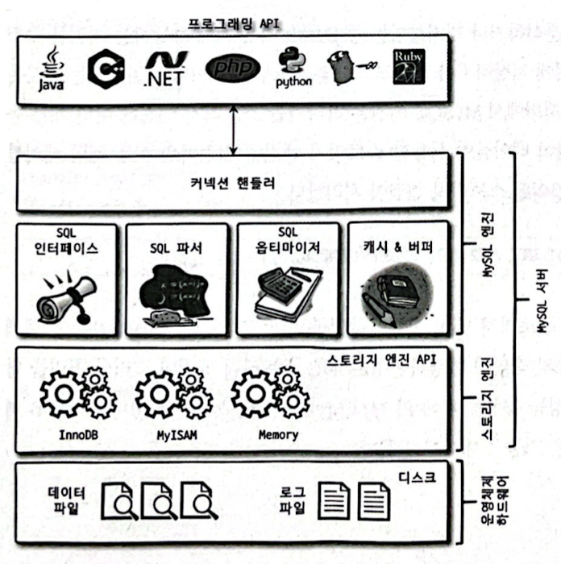
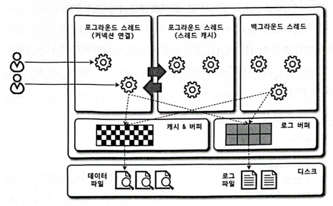
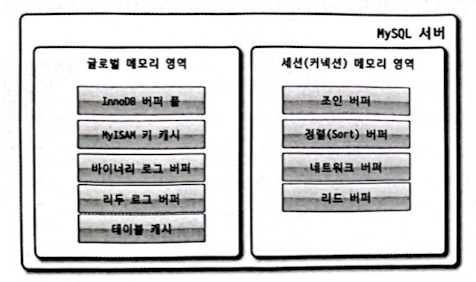
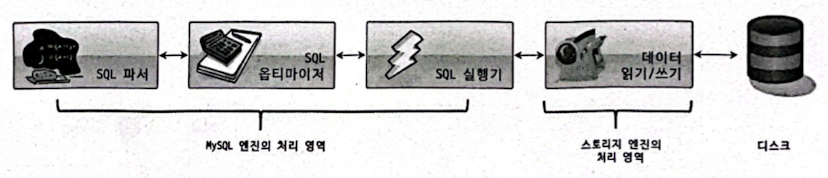
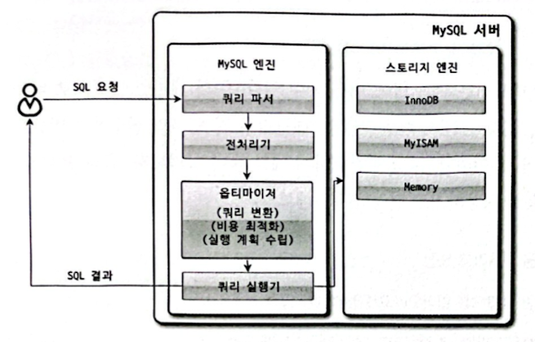
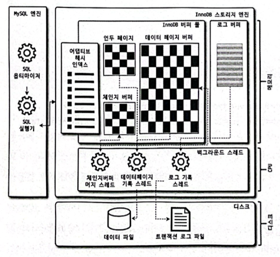
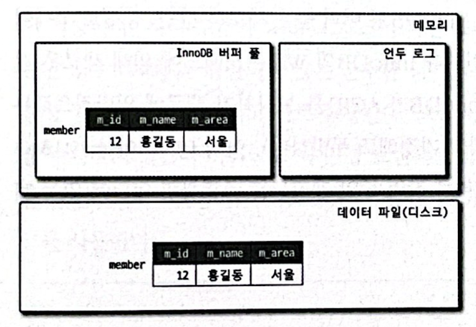
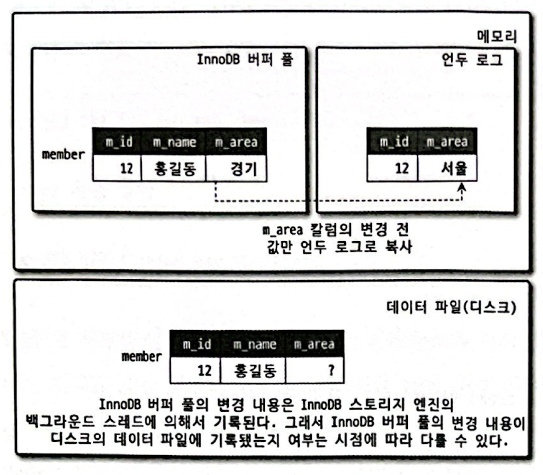
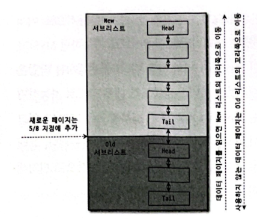
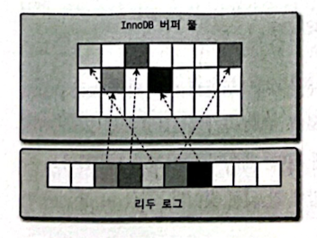

# CH.04 아키텍처
## 4.1 MySQL 엔진 아키텍처
### 4.1.1 MySQL의 전체 구조

#### 4.1.1.1 MySQL 엔진
- MySQL 엔진은 클라이언트로부터의 접속 및 쿼리 요청을 처리하는 커넥션 핸들러와 SOL 파서 및 전처리기, 쿼리의 최적화된 실행을 위한 옵티마이저가 중심을 이룬다.
#### 4.1.1.2 스토리지 엔진
- MySQL 엔진은 요청된 SQL 문장을 분석하거나 최적화하는 등 DBMS의 두뇌에 해당하는 처리를 수행하고, 실제 데이터를 디스크 스토리지에 저장하거나 디스크 스토리지로부터 데이터를 읽어오는 부분은 스토리지 엔진이 전담한다.
- MySQL 서버에서 MySQL 엔진은 하나지만 스토리지 엔진은 여러 개를 동시에 사용할 수 있다.
- 테이블이 사용할 스토리지 엔진을 지정하면 이후 해당 테이블의 모든 읽기 작업이나 변경 작업은 정의된 스토리지 엔진이 처리한다.
#### 4.1.1.3 핸들러 API
- MySQL 엔진의 쿼리 실행기에서 데이터를 쓰거나 읽어야 할 때는 각 스토리지 엔진에 쓰기 또는 읽기를 요청하는데, 이러한 요청을 핸들러(Handler) 요청이라 하고, 여기서 사용되는 API를 핸들러 API 라고 한다.
### 4.1.2 MySQL 스레딩 구조

- MySQL 서버는 프로세스 기반이 아니라 스레드 기반으로 작동하며, 크게 포그라운드(Foreground) 스레드와 백그라운드(Background) 스레드로 구분할 수 있다.
- MySQL 서버에서 실행중인 스레드의 목록은 다음과 같이 performance_schema 데이터베이스의 threads 테이블을 통해 확인할 수 있다.
- 전체 44개의 스레드가 실행 중이며, 그중에서 41개의 스레드가 백그라운드 스레드이고 나머지 3개만 포그라운드 스레드로 표시돼 있다.
- 그런데 이 중에서 마지막 'thread/sql/one_connection' 스레드만 실제 사용자의 요청을 처리하는 포그라운드 스레드다.
#### 4.1.2.1 포그라운드 스레드(클라이언트 스레드)
- 클라이언트 사용자가 작업을 마치고 커넥션을 종료하면 해당 커넥션을 담당하던 스레드는 다시 스레드 캐시(Thread cache)로 되돌아간다.
- 이때 이미 스레드 캐시에 일정 개수 이상의 대기중인 스레드가 있으면 스레드 캐시에 넣지 않고 스레드를 종료시켜 일정 개수의 스레드만 스레드 캐시에 존재하게 한다.
- 포그라운드 스레드는 데이터를 MySQL의 데이터 버퍼나 캐시로부터 가져오며, 버퍼나 캐시에 없는 경우에는 직접 디스크의 데이터나 인덱스 파일로부터 데이터를 읽어와서 작업을 처리한다.
- InnoDB 테이블은 데이터 버퍼나 캐시까지만 포그라운드 스레드가 처리하고, 나머지 버퍼로부터 디스크까지 기록하는 작업은 백그라운드 스레드가 처리한다.
#### 4.1.2.2 백그라운드 스레드
- InnoDB 백그라운드
  - 인서트 버퍼(nsert Buiter)를 병합하는 스레드
  - 로그를 디스크로 기록하는 스레드
  - InnoDB 버퍼 풀의 데이터를 디스크에 기록하는 스레드
  - 데이터를 버퍼로 읽어 오는 스레드
  - 잠금이나 데드락을 모니터링하는 스레드
- 사용자의 요청을 처리하는 도중 데이터의 쓰기 작업은 지연(버퍼링)되어 처리될 수 있지만 데이터의 읽기 작업은 절대 지연될 수 없다.
- 그래서 일반적인 상용 DBMS에는 대부분 쓰기 작업을 버퍼링해서 일괄 처리하는 기능이 탑재돼 있으며, InnoDB 또한 이러한 방식으로 처리한다.
- InnoDB에서는 INSERT, UPDATE, DELETE 쿼리로 데이터가 변경되는 경우 데이터가 디스크의 데이터 파일로 완전히 저장될 때까지 기다리지 않아도 된다.
### 4.1.3 메모리 할당 및 사용 구조

- 글로벌 메모리 영역의 모든 메모리 공간은 MySOL 서버가 시작되면서 운영체제로부터 할당된다.
#### 4.1.3.1 글로벌 메모리 영역
- 일반적으로 클라이언트 스레드의 수와 무관하게 하나의 메모리 공간만 할당된다.
- 필요에 따라 2개 이상의 메모리 공간을 할당받을 수도 있지만 클라이언트의 스레드 수와는 무관하며, 생성된 글로벌 영역이 N개라 하더라도 모든 스레드에 의해 공유된다.
- 글로벌 메모리 영역
  - 테이블 캐시
  - InnoDB 버퍼 풀
  - InnoDB 어댑티브 해시 인덱스
  - InnoDB 리두 로그 버퍼
#### 4.1.3.2 로컬 메모리 영역
- 세션 메모리 영역이라고도 표현하며, MySQL 서버상에 존재하는 클라이언트 스레드가 쿼리를 처리하는 데 사용하는 메모리 영역이다.
- 클라이언트와 MySQL 서버와의 커넥션을 세션이라고 하기 때문에 로컬 메모리 영역을 세션 메모리 영역이라고도 표현한다.
- 로컬 메모리는 각 클라이언트 스레드별로 독립적으로 할당되며 절대 공유되어 사용되지 않는다.
- 로컬 메모리는 각 쿼리의 용도별로 필요할 때만 공간이 할당되고 필요하지 않은 경우에는 MySQL이 메모리 공간을 할당조차도 하지 않을수도 있다는 점이다.
- 로컬 메모리 공간은 커넥션이 열려있는 동안 계속 할당된 상태로 남아있는 공간도 있고(커넥션 버퍼나 결과 버퍼) 그렇지 않고 쿼리를 실행하는 순간에만 할당했다가 다시 해제하는 공간(소트 버퍼나 조인 버퍼)도 있다.
- 로컬 메모리 영역
  - 정렬 버퍼(Sor buffer)
  - 조인 버퍼
  - 바이너리 로그 캐시
  - 네트워크 버퍼
### 4.1.4 플러그인 스토리지 엔진 모델
- 전문 검색 엔진을 위한 검색어 파서(인덱싱할 키워드를 분리해내는 작업)도 플러그인 형태로 개발해서 사용할 수 있으며, 사용자의 인증을 위한 Native Authentication과 Caching SHA-2 Authentication 등도 모두 플러그인으로 구현되어 제공된다.
- MySQL에서 쿼리가 실행되는 과정을 거의 대부분의 작업이 MySQL 엔진에서 처리되고, 마지막 '데이터 읽기/쓰기' 작업만 스토리지 엔진에 의해 처리된다.


- 핸들러라는 단어는 MySQL 서버의 소스코드로부터 넘어온 표현인데, 이는 우리가 매일 타고 다니는 자동차로 비유해보면 쉽게 이해할 수 있다.
- 사람이 핸들(운전대)을 이용해 자동차를 운전하듯이, 프로그래밍 언어에서는 어떤 기능을 호출하기 위해 사용하는 운전대와 같은 역할을 하는 객체를 핸들러(또는 핸들러 객체)라고 표현한다.
- MySQL 서버에서 MySQL 엔진은 사람 역할을 하고 각 스토리지 엔진은 자동차 역할을 하는데, MySQL 엔진이 스토리지 엔진을 조정하기 위해 핸들러라는 것을 사용하게 된다.
- MySQL에서 MyISAM이나 InnoDB와 같이 다른 스토리지 엔진을 사용하는 테이블에 대해 쿼리를 실행하더라도 MySQL의 처리 내용은 대부분 동일하며, 단순히 '데이터 읽기/쓰기' 영역의 처리만 차이가 있을 뿐이다.
```text
mysql> SHOW ENGINES;
```
| Engine | Support | Comment | Transactions | XA | Savepoints |
|--------|---------|---------|--------------|-----|------------|
| ARCHIVE | YES | Archive storage engine | NO | NO | NO |
| BLACKHOLE | YES | /dev/null storage engine (anything you write to it disappears) | NO | NO | NO |
| MRG_MYISAM | YES | Collection of identical MyISAM tables | NO | NO | NO |
| FEDERATED | NO | Federated MySQL storage engine | NULL | NULL | NULL |
| MyISAM | YES | MyISAM storage engine | NO | NO | NO |
| PERFORMANCE_SCHEMA | YES | Performance Schema | NO | NO | NO |
| InnoDB | DEFAULT | Supports transactions, row-level locking, and foreign keys | YES | YES | YES |
| MEMORY | YES | Hash based, stored in memory, useful for temporary tables | NO | NO | NO |
| CSV | YES | CSV storage engine | NO | NO | NO |
- YES: MySQL 서버(mysqld)에 해당 스토리지 엔진이 포함돼 있고, 사용 가능으로 활성화된 상태임
- DEFAULT: 'YES'와 동일한 상태이지만 필수 스토리지 엔진임을 의미함(즉, 이 스토리지 엔진이 없으면 MySQL이 시작되지 않을 수도 있음을 의미한다)
- NO: 현재 MySQL 서버(nysqld)에 포함되지 않았음을 의미함
- DISABLED: 현재 MySQL 서버(mysqld)에는 포함됐지만 파라미터에 의해 비활성화된 상태임
- SHOW PLUGINS 명령으로 스토리지 엔진뿐 아니라 인증 및 전문 검색용 파서와 같은 플러그인도 (설치돼 있다면) 확인할 수 있다.

| Name | Status | Type | Library | License |
|------|--------|------|---------|---------|
| binlog | ACTIVE | STORAGE ENGINE | NULL | GPL |
| mysql_native_password | ACTIVE | AUTHENTICATION | NULL | GPL |
| sha256_password | ACTIVE | AUTHENTICATION | NULL | GPL |
| caching_sha2_password | ACTIVE | AUTHENTICATION | NULL | GPL |
| sha2_cache_cleaner | ACTIVE | AUDIT | NULL | GPL |
| CSV | ACTIVE | STORAGE ENGINE | NULL | GPL |
| MEMORY | ACTIVE | STORAGE ENGINE | NULL | GPL |
| InnoDB | ACTIVE | STORAGE ENGINE | NULL | GPL |
| INNODB_TRX | ACTIVE | INFORMATION SCHEMA | NULL | GPL |
| INNODB_CMP | ACTIVE | INFORMATION SCHEMA | NULL | GPL |
| INNODB_CMP_RESET | ACTIVE | INFORMATION SCHEMA | NULL | GPL |
| MyISAM | ACTIVE | STORAGE ENGINE | NULL | GPL |
| MRG_MYISAM | ACTIVE | STORAGE ENGINE | NULL | GPL |
| PERFORMANCE_SCHEMA | ACTIVE | STORAGE ENGINE | NULL | GPL |
| TempTable | ACTIVE | STORAGE ENGINE | NULL | GPL |
| ARCHIVE | ACTIVE | STORAGE ENGINE | NULL | GPL |
| BLACKHOLE | ACTIVE | STORAGE ENGINE | NULL | GPL |
| FEDERATED | DISABLED | STORAGE ENGINE | NULL | GPL |
| ngram | ACTIVE | FTPARSER | NULL | GPL |
| mysqlx_cache_cleaner | ACTIVE | AUDIT | NULL | GPL |
| mysqlx | ACTIVE | DAEMON | NULL | GPL |
- 인증이나 전문 검색파서 또는 쿼리 재작성과 같은 플러그인이 있으며, 비밀번호 검증과 커넥션 제어 등에 관련된 다양한 플러그인이 제공된다.
### 4.1.5 컴포넌트
- MySQL 8.0부터는 기존의 플러그인 아키텍처를 대체하기 위해 컴포넌트 아키텍처가 지원된다.
- 컴포넌트는 이러한 단점들을 보완해서 구현됐다.
  - 플러그인은 오직 MySQL 서버와 인터페이스할 수 있고, 플러그인끼리는 통신할 수 없음
  - 플러그인은 MySQL 서버의 변수나 함수를 직접 호출하기 때문에 안전하지 않음(캡슐화 안 됨)
  - 플러그인은 상호의존 관계를 설정할 수 없어서 초기화가 어려움
### 4.1.6 쿼리 실행 구조

#### 4.1.6.1 쿼리 파서
- 쿼리파서는 사용자 요청으로 들어온 쿼리 문장을 토큰(MySQL이 인식할 수 있는 최소 단위의 어휘나 기호)으로 분리해 트리형태의 구조로 만들어내는 작업을 의미한다.
- 쿼리문장의 기본 문법오류는 이 과정에서 발견되고 사용자에게 오류 메시지를 전달하게 된다.
#### 4.1.6.2 전처리기
- 파서 과정에서 만들어진 파서트리를 기반으로 쿼리문장에 구조적인 문제점이 있는지 확인한다.
- 각 토큰을 테이블 이름이나 칼럼 이름, 또는 내장함수와 같은 개체를 매핑해 해당 객체의 존재여부와 객체의 접근권한 등을 확인하는 과정을 이 단계에서 수행한다.
#### 4.1.6.3 옵티마이저
- 옵티마이저란 사용자의 요청으로 들어온 쿼리문장을 저렴한 비용으로 가장 빠르게 처리할지를 결정하는 역할을 담당하며, DBMS의 두뇌에 해당한다고 볼 수 있다.
#### 4.1.6.4 실행 엔진
- 실행 엔진이 하는 일의 예
  1. 실행엔진이 핸들러에게 임시 테이블을 만들라고 요청
  2. 다시 실행 엔진은 WHERE 절에 일치하는 레코드를 읽어오라고 핸들러에게 요청
  3. 읽어온 레코드들을 1번에서 준비한 임시 테이블로 저장하라고 다시 핸들러에게 요청
  4. 데이터가 준비된 임시 테이블에서 필요한 방식으로 데이터를 읽어오라고 핸들러에게 다시 요청
  5. 최종적으로 실행엔진은 결과를 사용자나 다른 모듈로 넘김
- 실행엔진은 만들어진 계획대로 각 핸들러에게 요청해서 받은 결과를 또다른 핸들러 요청의 입력으로 연결하는 역할을 수행한다.
#### 4.1.6.5 핸들러(스토리지 엔진)
- 핸들러는 MysOL 서버의 가장 밑단에서 MySQL 실행엔진의 요청에 따라 데이터를 디스크로 저장하고 디스크로부터 읽어오는 역할을 담당한다.
- MyISAM 테이블을 조작하는 경우에는 핸들러가 MyISAM 스토리지 엔진이 되고, InnoDB 테이블을 조작하는 경우에는 핸들러가 InnoDB 스토리지 엔진이 된다.
### 4.1.7 복제
### 4.1.8 쿼리 캐시
- 쿼리캐시는 SQL의 실행결과를 메모리에 캐시하고, 동일 SQL쿼리가 실행되면 테이블을 읽지않고 즉시 결과를 반환하기 때문에 매우 빠른 성능을 보였다.
- 하지만 쿼리캐시는 테이블의 데이터가 변경되면 캐시에 저장된 결과중에서 변경된 테이블과 관련된 것들은 모두 삭제(Invalidate) 해야했다. 이는 심각한 동시처리 성능저하를 유발한다.
- MySQL 8.0으로 올라오면서 쿼리캐시는 MySQL 서버의 기능에서 완전히 제거되고, 관련된 시스템변수도 모두 제거됐다.
### 4.1.9 스레드 풀
- 여기서는 MySQL 엔터프라이즈 에디션에 포함된 스레드 풀 대신 Percona Server에서 제공하는 스레드 풀 기능을 살펴보고자 한다.
- 스레드 풀은 내부적으로 사용자의 요청을 처리하는 스레드 개수를 줄여서 동시처리되는 요청이 많다 하더라도 MySQL 서버의 CPU가 제한된 개수의 스레드 처리에만 집중할 수 있게 해서 서버의 자원 소모를 줄이는 것이 목적이다.
- 스레드 풀은 동시에 실행중인 스레드들을 CPU가 최대한 잘 처리해낼 수 있는 수준으로 줄여서 빨리 처리하게 하는 기능이기 때문에 스케줄링 과정에서 CPU 시간을 제대로 확보하지 못하는 경우에는 쿼리처리가 더 느려지는 사례도 발생할 수 있다.
- 물론 제한된 수의 스레드만으로 CPU가 처리하도록 적절히 유도한다면 CPU의 프로세서 친화도(Processor affinity)도 높이고 운영체제 입장에서는 불필요한 컨텍스트 스위치(Context Switch)를 줄여서 오버헤드를 낮출 수 있다.
- Percona Server의 스레드 풀은 기본적으로 CPU 코어의 개수만큼 스레드 그룹을 생성하는데, 스레드 그룹의 개수는 thread_pool_size 시스템 변수를 변경해서 조정할 수 있다.
- 하지만 일반적으로는 CPU 코어의 개수와 맞추는 것이 CPU 프로세서 친화도를 높이는데 좋다.
- 스레드 그룹의 모든 스레드가 일을 처리하고 있다면 스레드 풀은 해당 스레드 그룹에 새로운 작업 스레드(Worker thread)를 추가할지, 아니면 기존 작업 스레드가 처리를 완료할 때까지 기다릴지 여부를 판단해야 한다.
- 스레드 풀의 타이머 스레드는 주기적으로 스레드 그룹의 상태를 체크해서 thread_pool_stall_limit 시스템 변수에 정의된 밀리초만큼 작업 스레드가 지금 처리중인 작업을 끝내지 못하면 새로운 스레드를 생성해서 스레드 그룹에 추가한다.
- 이때 전체 스레드 풀에 있는 스레드의 개수는 thread_pool_max_threads 시스템 변수에 설정된 개수를 넘어설 수 없다.
- 즉, 모든 스레드 그룹의 스레드가 각자 작업을 처리하고 있는 상태에서 새로운 쿼리요청이 들어오더라도 스레드 풀은 thread_pool_stall_limit 시간동안 기다려야만 새로 들어온 요청을 처리할 수 있다는 뜻이다.
- 따라서 응답시간에 아주 민감한 서비스라면 thread_pool_stall_limit 시스템 변수를 적절히 낮춰서 설정해야 한다.
- Percona Server의 스레드 풀 플러그인은 선순위 큐와 후순위 큐를 이용해 특정 트랜잭션이나 쿼리를 우선적으로 처리할 수 있는 기능도 제공한다.
- 이렇게 먼저 시작된 트랜잭션 내에 속한 SQL을 빨리 처리해주면 해당 트랜잭션이 가지고 있던 잠금이 빨리 해제되고 잠금 경합을 낮춰서 전체적인 처리성능을 향상시킬 수 있다.
### 4.1.10 트랜잭션 지원 메타데이터
- 데이터베이스 서버에서 테이블의 구조 정보와 스토어드 프로그램 등의 정보를 데이터 딕셔너리 또는 메타데이터라고 한다.
- MySQL 8.0 버전부터는 테이블의 구조 정보나 스토어드 프로그램의 코드 관련정보를 모두 InnoDB의 테이블에 저장하도록 개선됐다.
- MySOL 서버가 작동하는 데 기본적으로 필요한 테이블들을 묶어서 시스템 테이블이라고 하는데, 대표적으로 사용자의 인증과 권한에 관련된 테이블들이 있다.
- MySQL 서버 8.0 버전부터는 이런 시스템 테이블을 모두 InnoDB 스토리지 엔진을 사용하도록 개선했으며, 시스템 테이블과 데이터 딕셔너리 정보를 모두 모아서 mysql DB에 저장하고 있다.
- MySQL 8.0 버전부터 데이터 딕셔너리와 시스템 테이블이 모두 트랜잭션 기반의 InnoDB 스토리지 엔진에 저장되도록 개선되면서 이제 스키마 변경작업 중간에 MySOL 서버가 비정상적으로 종료된다고 하더라도 스키마 변경이 완전한 성공 또는 완전한 실패로 정리된다.
- MySQL 서버에서 InnoDB 스토리지 엔진을 사용하는 테이블은 메타정보가 InnoDB 테이블 기반의 딕셔너리에 저장되지만 MyISAM이나 CSV 등과 같은 스토리지 엔진의 메타정보는 여전히 저장할 공간이 필요하다.
- MySQL 서버는 InnoDB 스토리지 엔진 이외의 스토리지 엔진을 사용하는 테이블들을 위해 SDI(Serialized Dictionary Information) 파일을 사용한다.
## 4.2 InnoDB 스토리지 엔진 아키텍처
- InnoDB는 MySQL에서 사용할 수 있는 스토리지 엔진 중 거의 유일하게 레코드 기반의 잠금을 제공하며, 그 때문에 높은 동시성 처리가 가능하고 안정적이며 성능이 뛰어나다.


### 4.2.1 프라이머리 키에 의한 클러스터링
- InnoDB의 모든 테이블은 기본적으로 프라이머리 키를 기준으로 클러스터링되어 저장된다.
- 즉, 프라이머리 키 값의 순서대로 디스크에 저장된다는 뜻이며, 모든 세컨더리 인덱스는 레코드의 주소 대신 프라이머리 키의 값을 논리적인 주소로 사용한다.
- 프라이머리 키가 클러스터링 인덱스이기 때문에 프라이머리 키를 이용한 레인지 스캔은 상당히 빨리 처리될 수 있다.
- InnoDB 스토리지 엔진과는 달리 MyISAM 스토리지 엔진에서는 클러스터링 키를 지원하지 않는다.
### 4.2.2 외래 키 지원
- 외래키에 대한 지원은 InnoDB 스토리지 엔진 레벨에서 지원하는 기능으로 MyISAM이나 MEMORY 테이블에서는 사용할 수 없다.
- InnoDB에서 외래키는 부모 테이블과 자식 테이블 모두 해당 칼럼에 인덱스 생성이 필요하고, 변경 시에는 반드시 부모 테이블이나 자식 테이블에 데이터가 있는지 체크하는 작업이 필요하므로 잠금이 여러 테이블로 전파되고, 그로 인해 데드락이 발생할 때가 많으므로 개발할 때도 외래키의 존재에 주의하는 것이 좋다.
- 수동으로 데이터를 적재하거나 스키마 변경 등의 관리작업이 실패할 수 있다.
- 물론 부모 테이블과 자식 테이블의 관계를 명확히 파악해서 순서대로 작업한다면 문제없이 실행할 수 있지만 외래키가 복잡하게 얽힌 경우에는 그렇게 간단하지 않다.
- 이런 경우에는 foreign_key_checks 시스템 변수를 OFF로 설정하면 외래키 관계에 대한 체크 작업을 일시적으로 멈출 수 있다.
- 외래키 체크를 일시적으로 해제했다고 해서 부모와 자식 테이블 간의 관계가 깨진 상태로 그대로 유지해도 된다는 것을 의미하지는 않는다.
- 예를 들어, 외래키 체크를 일시적으로 중지한 상태에서 외래키 관계를 가진 부모 테이블의 레코드를 삭제했다면 반드시 자식 테이블의 레코드도 삭제해서 일관성을 맞춰준 후 다시 외래키 체크 기능을 활성화해야 한다.
### 4.2.3 MVCC(Multi Version Concurrency Control)
- MVCC의 가장 큰 목적은 잠금을 사용하지 않는 일관된 읽기를 제공하는데 있다.
- InnoDB는 언두 로그(Undo log)를 이용해 이 기능을 구현한다.
- 멀티 버전이라 함은 하나의 레코드에 대해 여러 개의 버전이 동시에 관리된다는 의미다.
```shell
mysql> CREATE TABLE member (
      m_id INT NOT NULL,
      m_name VARCHAR(20) NOT NULL,
      m_area VARCHAR(100) NOT NULL,
      PRIMARY KEY (m_id),
      INDEX ix_area (m_area)
);
mysql> INSERT INTO menber (m.id,m.name, m_area) VALUES (12,'홍길동','서울');
mysql> COMMIT;
```

```text
mysql> UPDATE member SET m_area='경기' WHERE m_id=12;
```

- UPDATE 문장이 실행되면 커밋 실행여부와 관계없이 InnoDB의 버퍼 풀은 새로운 값인 '경기'로 업데이트된다.
- 그리고 디스크의 데이터 파일에는 체크포인트나 InnoDB의 Write 스레드에 의해 새로운 값으로 업데이트돼 있을수도 있고 아닐수도 있다(InnoDB가 ACID를 보장하기 때문에 일반적으로는 InnoDB의 버퍼 풀과 데이터 파일은 동일한 상태라고 가정해도 무방하다).
- 아직 COMMIT이나 ROLLBACK이 되지 않은 상태에서 다른 사용자가 다음 같은 쿼리로 작업중인 레코드를 조회하면 어디에 있는 데이터를 조회할까?
```text
mysql> SELECT * FROM member WHERE m_id=12;
```
- 이 질문의 답은 MySQL 서버의 시스템 변수(transaction_isolation)에 설정된 격리수준(Isolation level)에 따라 다르다는 것이다.
- 격리수준이 READ_UNCOMMITTED인 경우에는 InnoDB 버퍼 풀이나 데이터 파일로부터 변경되지 않은 데이터를 읽어서 반환한다.
- 즉, 데이터가 커밋됐든 아니든 변경된 상태의 데이터를 반환한다.
- 그렇지 않고 READ_COMMITTED나 그 이상의 격리수준(REPEATABLE_READ, SERIALIZABLE)인 경우에는 아직 커밋되지 않았기 때문에 InnoDB 버퍼 풀이나 데이터 파일에 있는 내용대신 변경되기 이전의 내용을 보관하고 있는 언두 영역의 데이터를 반환한다.
- 이러한 과정을 DBMS에서는 MVCC 라고 표현한다.
- 여기서는 한 개의 데이터만 가지고 설명했지만 관리해야 하는 예전 버전의 데이터는 무한히 많아질 수 있다(트랜잭션이 길어지면 언두에서 관리하는 예전 데이터가 삭제되지 못하고 오랫동안 관리돼야 하며, 자연히 언두 영역이 저장되는 시스템 테이블스페이스의 공간이 많이 늘어나는 상황이 발생할 수도 있다).
- UPDATE 쿼리가 실행되면 InnoDB 버퍼 풀은 즉시 새로운 데이터로 변경되고 기존 데이터는 언두영역으로 복사되는 과정까지 살펴봤는데, 이 상태에서 COMMIT 명령을 실행하면 InnoDB는 더 이상의 변경작업 없이 지금의 상태를 영구적인 데이터로 만들어 버린다.
- 하지만 롤백을 실행하면 InnoDB는 언두 영역에 있는 백업된 데이터를 InnoDB 버퍼 풀로 다시 복구하고, 언두 영역의 내용을 삭제해 버린다.
- 커밋이 된다고 언두 영역의 백업 데이터가 항상 바로 삭제되는 것은 아니다.
- 이 언두 영역을 필요로 하는 트랜잭션이 더는 없을 때 비로소 삭제된다.
### 4.2.4 잠금 없는 일관된 읽기(Non-Locking Consistent Read)
- InnoDB 스토리지 엔진은 MVCC 기술을 이용해 잠금을 걸지 않고 읽기작업을 수행한다.
- 잠금을 걸지 않기 때문에 InnoDB에서 읽기 작업은 다른 트랜잭션이 가지고 있는 잠금을 기다리지 않고, 읽기작업이 가능하다.
- 격리수준이 SERIALIZABLE이 아닌 READ_UNCOMMITTED나 READ_COMMITTED, REPEATABLE_READ 수준인 경우 INSERT와 연결되지 않은 순수한 읽기(SELECT) 작업은 다른 트랜잭션의 변경작업과 관계없이 항상 잠금을 대기하지 않고 바로 실행된다.
- 오랜 시간동안 활성 상태인 트랜잭션으로 인해 MySQL 서버가 느려지거나 문제가 발생할 때가 가끔 있는데, 바로 이러한 일관된 읽기를 위해 언두 로그를 삭제하지 못하고 계속 유지해야하기 때문에 발생하는 문제다.
- 따라서 트랜잭션이 시작됐다면 가능한 한 빨리 롤백이나 커밋을 통해 트랜잭션을 완료하는 것이 좋다.
### 4.2.5 자동 데드락 감지
- InnoDB 스토리지 엔진은 데드락 감지 스레드를 가지고 있어서 데드락 감지 스레드가 주기적으로 잠금 대기 그래프를 검사해 교착상태에 빠진 트랜잭션들을 찾아서 그중 하나를 강제종료한다.
- 이때 어느 트랜잭션을 먼저 강제 종료할 것인지를 판단하는 기준은 트랜잭션의 언두 로그 양이며, 언두 로그 레코드를 더 적게 가진 트랜잭션이 일반적으로 롤백의 대상이 된다.
- 트랜잭션이 언두 레코드를 적게 가졌다는 이야기는 롤백을 해도 언두 처리를 해야할 내용이 적다는 것이며, 트랜잭션 강제 롤백으로 인한 MySOL 서버의 부하도 덜 유발하기 때문이다.
- InnoDB 스토리지 엔진은 상위 레이어인 MySOL 엔진에서 관리되는 테이블 잠금은 볼 수가 없어서 데드락 감지가 불확실할 수도 있는데, innodb_table_locks 시스템 변수를 활성화하면 InnoDB 스토리지 엔진 내부의 레코드 잠금뿐만 아니라 테이블 레벨의 잠금까지 감지할 수 있게 된다.
- 동시 처리 스레드가 매우 많아지거나 각 트랜잭션이 가진 잠금의 개수가 많아지면 데드락 감지 스레드가 느려진다.
- 데드락 감지 스레드가 느려지면 서비스 쿼리를 처리중인 스레드는 더는 작업을 진행하지 못하고 대기하면서 서비스에 악영향을 미치게 된다.
- 이렇게 동시 처리 스레드가 매우 많은 경우 데드락 감지 스레드는 더 많은 CPU 자원을 소모할 수도 있다.
- 이런 문제점을 해결하기 위해 MySQL 서버는 innodb_deadlock_detect 시스템 변수를 제공하며, innodb_deadlock_detect를 OFF로 설정하면 데드락 감지 스레드는 더는 작동하지 않게 된다.
- 데드락 감지 스레드가 작동하지 않으면 InnoDB 스토리지 엔진 내부에서 2개 이상의 트랜잭션이 상대방이 가진 잠금을 요구하는 상황(데드락 상황)이 발생해도 누군가가 중재를 하지 않기 때문에 무한정 대기하게 될 것이다.
- 하지만 innodb_lock_wait_timeout 시스템 변수를 활성화하면 이런 데드락 상황에서 일정 시간이 지나면 자동으로 요청이 실패하고 에러 메시지를 반환하게 된다.
### 4.2.6 자동화된 장애 복구
- MySQL 서버가 시작될 때 완료되지 못한 트랜잭션이나 디스크에 일부만 기록된 (Partial write) 데이터 페이지 등에 대한 일련의 복구작업이 자동으로 진행된다.
- 자동으로 복구될 수 없는 손상이 있다면 자동복구를 멈주고 MySQL 서버는 종료돼 버린다.
- 이때는 MySQL 서버의 설정 파일에 innodb_force_recovery 시스템 변수를 설정해서 MySQL 서버를 시작해야 한다.
- innodb_force_recovery가 0이 아닌 복구 모드에서는 SELECT 이외의 INSERT나 UPDATE, DELETE 같은 쿼리는 수행할 수 없다.
- 1(SRV_FORCE_IGNORE_CORRUPT)
  - InnoDB의 테이블스페이스의 데이터나 인덱스 페이지에서 손상된 부분이 발견돼도 무시하고 MySQL 서버를 시작한다.
  - 에러 로그 파일에 'Database page corruption on disk or a failed' 메시지가 출력될 때는 대부분 이 경우에 해당한다.
- 2(SRV_FORCE_NO_BACKGROUND)
  - InnoDB는 트랜잭션의 롤백을 위해 언두 데이터를 관리하는데, 트랜잭션이 커밋되어 불필요한 언두 데이터는 InnoDB의 메인 스레드에 의해 주기적으로 삭제된다.
  - InnoDB의 메인 스레드가 언두 데이터를 삭제하는 과정에서 장애가 발생한 다면 이 모드로 복구하면 된다.
- 3(SRV_FORCE_NO_TRX_UNDO)
  - InnoDB에서 트랜잭션이 실행되면 롤백에 대비해 변경전의 데이터를 언두 영역에 기록한다.
  - 일반적으로 MySQL 서버는 다시 시작하면서 언두 영역의 데이터를 먼저 데이터 파일에 적용하고 그다음 리두 로그의 내용을 다시 덮어써서 장애시점의 데이터 상태를 만들어낸다.
  - 정상적인 MySQL 서버의 시작에서는 최종적으로 커밋되지 않은 트랜잭션은 롤백을 수행하지만 innodb_force_recovery가 3으로 설정되면 커밋되지 않은 트랜잭션의 작업을 롤백하지 않고 그대로 놔둔다.
  - 즉, 커밋되지 않고 종료된 트랜잭션은 계속 그 상태로 남아있게 MySQL 서버를 시작하는 모드다.
- 4(SRV_FORCE_NO_IBUF_MERGE)
  - InnoDB는 INSERT, UPDATE, DELETE 등의 데이터 변경으로 인한 인덱스 변경작업을 상황에 따라 즉시 처리할 수도 있고 인서트 버퍼에 저장해두고 나중에 처리할 수도 있다.
  - 이렇게 인서트 버퍼에 기록된 내용은 언제 데이터 파일에 병합(Merge)될지 알 수 없다.
  - MySQL을 종료해도 병합되지 않을 수 있는데, 만약 MySQL이 재시작되면서 인서트 버퍼의 손상을 감지하면 InnoDB는 에러를 발생시키고 MySQL 서버는 시작하지 못한다.
  - 이때 innodb_force_recovery를 4로 설정하면 InnoDB 스토리지 엔진이 인서트 버퍼의 내용을 무시하고 강제로 MySQL이 시작되게 한다.
- 5(SRV_FORCE_NO_UNDO_LOG_SCAN)
  - MySQL 서버가 장애나 정상적으로 종료되는 시점에 진행중인 트랜잭션이 있었다면 MySQL은 그냥 단순히 그 커넥션을 강제로 끊어버리고 별도의 정리작업 없이 종료한다.
  - MySQL이 다시 시작하면 InnoDB 엔진은 언두 레코드를 이용해 데이터 페이지를 복구하고 리두 로그를 적용해 종료 시점이나 장애발생 시점의 상태를 재현해 낸다.
  - 그리고 InnoDB는 마지막으로 커밋되지 않은 트랜잭션에서 변경한 작업은 모두 롤백 처리한다.
  - 그런데 InnoDB의 언두 로그를 사용할 수 없다면 InnoDB 엔진의 에러로 MySQL 서버를 시작할 수 없다.
  - 이때 innodb_force_recovery 옵션을 5로 설정하면 InnoDB 엔진이 언두 로그를 모두 무시하고 MySQL을 시작할 수 있다.
  - 하지만 이 모드로 복구되면 MySQL 서버가 종료되던 시점에 커밋되지 않았던 작업도 모두 커밋된 것처럼 처리되므로 실제로는 잘못된 데이터가 데이터베이스에 남는 것이라고 볼 수 있다.
  - 이때도 mysqldump를 이용해 데이 터를 백업하고, 데이터베이스를 새로 구축해야 한다.
- 6(SRV_FORCE_NO_LOG_REDO)
  - InnoDB 스토리지 엔진의 리두 로그가 손상되면 MySQL 서버가 시작되지 못한다.
  - 이 복구모드로 시작하면 InNoDB 엔진은 리두 로그를 모두 무시한 채로 MySQL 서버가 시작된다.
  - 또한 커밋됐다 하더라도 리두 로그에만 기록되고 데이터 파일에 기록되지 않은 데이터는 모두 무시된다.
  - 이 때는 기존 InnoDB의 리두 로그는 모두 삭제하고 MySQL 서버를 시작하는 것이 좋다.
  - 이때도 mysqldump를 이용해 데이터를 모두 백업해서 MySQL 서버를 새로 구축하는 것이 좋다.
- 위와 같이 진행했음에도 MySQL 서버가 시작되지 않으면 백업을 이용해 다시 구축하는 방법밖에 없다.
- 백업이 있다면 마지막 백업으로 데이터베이스를 새로 구축하고, 바이너리 로그를 사용해 최대한 장애시점까지의 데이터를 복구할 수도 있다.
### 4.2.7 InnoDB 버퍼 풀
- InnoDB 스토리지 엔진에서 가장 핵심적인 부분으로, 디스크의 데이터 파일이나 인덱스 정보를 메모리에 캐시해 두는 공간이다.
- 쓰기 작업을 지연시켜 일괄 작업으로 처리할 수 있게 해주는 버퍼역할도 같이 한다.
- 일반적인 애플리케이션에서는 INSERT, UPOATE, DELETE처럼 데이터를 변경하는 쿼리는 데이터 파일의 이곳저곳에 위치한 레코드를 변경하기 때문에 랜덤한 디스크 작업을 발생시킨다.
- 하지만 버퍼 풀이 이러한 변경된 데이터를 모아서 처리하면 랜덤한 디스크 작업의 횟수를 줄일 수 있다.
#### 4.2.7.1 버퍼 풀의 크기 설정
- MySQL 서버 내에서 메모리를 필요로 하는 부분은 크게 없지만 아주 독특한 경우 레코드 버퍼가 상당한 메모리를 사용하기도 한다.
- 레코드 버퍼는 각 클라이언트 세션에서 테이블의 레코드를 읽고 쓸 때 버퍼로 사용하는 공간을 말하는데, 커넥션이 많고 사용하는 테이블도 많다면 레코드 버퍼 용도로 사용되는 메모리 공간이 꽤 많이 필요해질 수도 있다.
- 그래서 가능하면 InnoDB 버퍼 풀의 크기를 적절히 작은 값으로 설정해서 조금씩 상황을 봐 가면서 증가시키는 방법이 최적이다.
- 일반적으로 회사에서 이미 MySQL 서버를 사용하고 있다면 그 서버의 메모리 설정을 기준으로 InnoDB 버퍼 풀의 크기를 조정하면 된다.
- 하지만 처음으로 MySQL 서버를 준비한다면 다음과 같은 방법으로 InnoDB 버퍼 풀 설정을 찾아가는 방법을 권장한다.
- 운영체제의 전체 메모리 공간이 8GB 미만이라면 50% 정도만 InnoDB 버퍼 풀로 설정하고 나머지 메모리 공간은 MySOL 서버와 운영체제, 그리고 다른 프로그램이 사용할 수 있는 공간으로 확보해주는 것이 좋다.
- 전체 메모리 공간이 그 이상이라면 InnoDB 버퍼 풀의 크기를 전체 메모리의 50%에서 시작해서 조금씩 올려가면서 최적점을 찾는다.
- InnoDB 버퍼 풀은 innodb_buffer_pool_size 시스템 변수로 크기를 설정할 수 있으며, 동적으로 버퍼 풀의 크기를 확장할 수 있다.
- 버퍼 풀의 크기 변경은 크리티컬한 변경이므로 가능하면 MySOL 서버가 한가한 시점을 골라서 진행하는 것이 좋다.
- InnoDB 버퍼 풀은 내부적으로 128MB 청크 단위로 쪼개어 관리되는데, 이는 버퍼 풀의 크기를 줄이거나 늘리기 위한 단위 크기로 사용된다.
- InnoDB 버퍼 풀은 전통적으로 버퍼 풀 전체를 관리하는 잠금(세마포어)으로 인해 내부잠금 경합을 많이 유발해왔는데, 이런 경합을 줄이기 위해 버퍼 풀을 여러 개로 쪼개어 관리할 수 있게 개선됐다.
- 버퍼 풀이 여러 개의 작은 버퍼 풀로 쪼개지면서 개별 버퍼 풀 전체를 관리하는 잠금(세마포어) 자체도 경합이 분산되는 효과를 내게 되는 것이다.
#### 4.2.7.2 버퍼 풀의 구조
- InnoDB 스토리지 엔진은 버퍼 풀이라는 거대한 메모리 공간을 페이지 크기의 조각으로 쪼개어 InnoDB 스토리지 엔진이 데이터를 필요로 할 때 해당 데이터 페이지를 읽어서 각 조각에 저장한다.
- 버퍼 풀의 페이지 크기 조각을 관리하기 위해 InnoDB 스토리지 엔진은 크게 LRU(Least Recently Used) 리스트와 플러시(Flush) 리스트, 그리고 프리(Free) 리스트라는 3개의 자료구조를 관리한다.
- 프리 리스트는 InnoDB 버퍼 풀에서 실제 사용자 데이터로 채워지지 않은 비어있는 페이지들의 목록이며, 사용자의 쿼리가 새롭게 디스크의 데이터 페이지를 읽어와야 하는 경우 사용된다.


- LRU 리스트를 관리하는 목적은 디스크로부터 한 번 읽어온 페이지를 최대한 오랫동안 InnoDB 버퍼 풀의 메모리에 유지해서 디스크 읽기를 최소화하는 것이다.
- InnoDB 스토리지 엔진에서 데이터를 찾는 과정
  1. 필요한 레코드가 저장된 데이터 페이지가 버퍼 풀에 있는지 검사
     1. InnoDB 어댑티브 해시 인덱스를 이용해 페이지를 검색
     2. 해당 테이블의 인덱스(B-Tree)를 이용해 버퍼 풀에서 페이지를 검색
     3. 버퍼 풀에 이미 데이터 페이지가 있었다면 해당 페이지의 포인터를 MRU 방향으로 승급
  2. 디스크에서 필요한 데이터 페이지를 버퍼 풀에 적재하고, 적재된 페이지에 대한 포인터를 LRU 헤더 부분에 추가
  3. 버퍼 풀의 LRU 헤더 부분에 적재된 데이터 페이지가 실제로 읽히면 MRU 헤더 부분으로 이동
  4. 버퍼 풀에 상주하는 데이터 페이지는 사용자 쿼리가 얼마나 최근에 접근했었는지에 따라 나이(Age)가 부여되며, 버퍼 풀에 상주하는 동안 쿼리에서 오랫동안 사용되지 않으면 데이터 페이지에 부여된 나이가 오래되고('Aging'이라고 함) 결국 해당 페이지는 버퍼 풀에서 제거된다. 버퍼 풀의 데이터 페이지가 쿼리에 의해 사용되면 나이가 초기화되어 다시 젊어지고 MRU의 헤더 부분으로 옮겨진다.
  5. 필요한 데이터가 자주 접근됐다면 해당 페이지의 인덱스 키를 어댑티브 해시 인덱스에 추가
- 그래서 처음 한 번 읽힌 데이터 페이지가 이후 자주 사용된다면 그 데이터 페이지는 InnoDB 버퍼 풀의 MRU 영역에서 계속 살아남게 되고, 반대로 거의 사용되지 않는다면 새롭게 디스크에서 읽히는 데이터 페이지들에 밀려서 LRU의 끝으로 밀려나 결국은 InnoDB 버퍼 풀에서 제거될 것이다.
- 플러시 리스트는 디스크로 동기화되지 않은 데이터를 가진 데이터 페이지(이를 더티 페이지라고 함)의 변경시점 기준의 페이지 목록을 관리한다.
- 디스크에서 읽은 상태 그대로 전혀 변경이 없다면 플러시 리스트에 관리되지 않지만, 일단 한번 데이터 변경이 가해진 데이터 페이지는 플러시 리스트에 관리되고 특정 시점이 되면 디스크로 기록돼야 한다.
- 데이터가 변경되면 InnoDB는 변경내용을 리두 로그에 기록하고 버퍼 풀의 데이터 페이지에도 변경내용을 반영한다.
#### 4.2.7.3 버퍼 풀과 리두 로그
- InnoDB 버퍼 풀은 데이터베이스 서버의 성능 향상을 위해 데이터 캐시와 쓰기 버퍼링이라는 두 가지 용도가 있는데, 버퍼 풀의 메모리 공간만 단순히 늘리는 것은 데이터 캐시기능만 향상시키는 것이다.
- InnoDB 버퍼 풀의 쓰기 버퍼링 기능까지 향상시키려면 InnoDB 버퍼 풀과 리두 로그와의 관계를 먼저 이해해야 한다.
- 

- InnoDB의 버퍼 풀은 디스크에서 읽은 상태로 전혀 변경되지 않은 클린 페이지(Clean Page)와 함께 INSERT, UPDATE, DELETE 명령으로 변경된 데이터를 가진 더티 페이지(Dirty Page)도 가지고 있다.
- 더티 페이지는 디스크와 메모리(버퍼 풀)의 데이터 상태가 다르기 때문에 언젠가는 디스크로 기록돼야 한다.
- 하지만 더티 페이지는 버퍼 풀에 무한정 머무를 수 있는 것은 아니다.
- InnoDB 스토리지 엔진에서 리두 로그는 1개 이상의 고정크기 파일을 연결해서 순환고리처럼 사용한다.
- 즉, 데이터 변경이 계속 발생하면 리두 로그 파일에 기록됐던 로그 엔트리는 어느 순간 다시 새로운 로그 엔트리로 덮어 쓰인다.
- 리두 로그 파일의 공간은 계속 순환되어 재사용되지만 매번 기록될 때마다 로그 포지션은 계속 증가된 값을 갖게 되는데, 이를 LSN(Log Sequence Number)이라고 한다.
- InnoDB 스토리지 엔진은 주기적으로 체크포인트 이벤트를 발생시켜 리두 로그와 버퍼 풀의 더티 페이지를 디스크로 동기화하는 데, 이렇게 발생한 체크포인트 중 가장 최근 체크포인트 지점의 LSN이 활성 리두 로그 공간의 시작점이 된다.
#### 4.2.7.4 버퍼 풀 플러시(Buffer Pool Flush)
- MySQL 5.7 버전을 거쳐서 MySQL 8.0 버전으로 업그레이드되면서 대부분의 서비스에서는 더티 페이지를 디스크에 동기화하는 부분(더티 페이지 플러시)에서 예전과 같은 디스크 쓰기 폭증 현상은 발생하지 않았다.
- InnoDB 스토리지 엔진은 버퍼 풀에서 아직 디스크로 기록되지 않은 더티 페이지들을 성능상의 악영향 없이 디스크에 동기화하기 위해 다음과 같이 2개의 플러시 기능을 백그라운드로 실행한다.
  - 플러시 리스트(Flush_list) 플러시
  - LRU 리스트(LRU_list) 플러시
#### 4.2.7.4.1 플러시 리스트 플러시
- InnoDB 스토리지 엔진은 리두 로그 공간의 재활용을 위해 주기적으로 오래된 리두 로그 엔트리가 사용하는 공간을 비워야 한다.
- 이때 오래된 리두 로그 공간이 지워지려면 반드시 InnoDB 버퍼 풀의 더티 페이지가 먼저 디스크로 동기화돼야 한다.
- 이를 위해 InnoDB 스토리지 엔진은 주기적으로 플러시 리스트(Flush_list) 플러시 함수를 호출해서 플러시 리스트에서 오래전에 변경된 데이터 페이지 순서대로 디스크에 동기화하는 작업을 수행한다.
- InnoDB 스토리지 엔진에서 더티 페이지를 디스크로 동기화하는 스레드를 클리너 스레드(Cleaner Thread)라고 한다.
- 기본적으로 InnoDB 스토리지 엔진은 전체 버퍼 풀이 가진 페이지의 90%까지 더티 페이지를 가질 수 있다.
- InnoDB 버퍼 풀에 더티 페이지가 많으면 많을수록 디스크 쓰기 폭발(Disk IO Burst) 현상이 발생할 가능성이 높아진다.
- InnoDB 스토리지 엔진은 innodb_io_capacity 시스템 변수에 설정된 값을 기준으로 더티 페이지 쓰기를 실행한다.
- 하지만 디스크로 기록되는 더티 페이지 개수보다 더 많은 더티 페이지가 발생하면 버퍼 풀에 더티 페이지가 계속 증가하게 되고, 어느 순간 더티 페이지의 비율이 90%를 넘어가면 InnoDB 스토리지 엔진은 급작스럽게 더티 페이지를 디스크로 기록해야 한다고 판단한다.
- 그래서 급작스럽게 디스크 쓰기가 폭증하는 현상이 발생한다.
- 이런 문제를 완화하기 위해 InnoDB 스토리지 엔진에서는 innodb_max_dirty_pages_pct_lwm이라는 시스템 설정변수를 이용해 일정 수준 이상의 더티 페이지가 발생하면 조금씩 더티 페이지를 디스크로 기록하게 하고 있다.
- innodb_io_capacity와 innodb_io_capacity_max 시스템 변수는 각 데이터베이스 서버에서 어느 정도의 디스크 읽고 쓰기가 가능한지를 설정하는 값이다.
- 어댑티브 플러시는 innodb_adaptive_flushing 시스템 변수로 켜고 끌 수 있는데, 기본값은 어댑티브 플러시를 사용하는 것이다.
- 어댑티브 플러시 기능이 활성화되면 InnoDB 스토리지 엔진은 단순히 버퍼 풀의 더티 페이지 비율이나 innodb_io_capacity, innodb_io_capacity_max 설정값에 의존하지 않고 새로운 알고리즘을 사용한다.
- 어댑티브 플러시 알고리즘은 리두 로그의 증가속도를 분석해서 적절한 수준의 더티 페이지가 버퍼 풀에 유지될 수 있도록 디스크 쓰기를 실행한다.
- innodb_adaptive_flushing_lwm 시스템 변수의 기본값은 10%인데, 이는 전체 리두 로그 공간에서 활성 리두 로그의 공간이 10% 미만이면 어댑티브 플러시가 작동하지 않다가 10%를 넘어서면 그때부터 어댑티브 플러시 알고리즘이 작동하게 한다.
#### 4.2.7.4.2 LRU 리스트 플러시
- InnoDB 스토리지 엔진은 LRU 리스트에서 사용 빈도가 낮은 데이터 페이지들을 제거해서 새로운 페이지들을 읽어올 공간을 만들어야 하는데, 이를 위해 LRU 리스트(LRU_list) 플러시 함수가 사용된다.
- InnoDB 스토리지 엔진은 LRU 리스트의 끝부분부터 시작해서 최대 innodb_lru_scan_depth 시스템 변수에 설정된 개수만큼의 페이지들을 스캔한다.
- InnoDB 스토리지 엔진은 이때 스캔하면서 더티 페이지는 디스크에 동기화하게 하며, 클린 페이지는 즉시 프리(Free) 리스트로 페이지를 옮긴다.
#### 4.2.7.5 버퍼 풀 상태 백업 및 복구
- 디스크의 데이터가 버퍼 풀에 적재돼있는 상태를 워밍업(Warming Up)이라고 표현하는데, 버퍼 풀이 잘 워밍업된 상태에서는 그렇지 않은 경우보다 몇십 배의 쿼리 처리속도를 보이는 것이 일반적이다.
- MySQL 5.6 버전부터는 버퍼 풀 덤프 및 적재 기능이 도입됐다.
- 서버 점검이나 기타 작업을 위해 MySQL 서버를 재시작해야 하는 경우 MySQL 서버를 셧다운하기 전에 다음과 같이 innodb_buffer_pool_dump_now 시스템 변수를 이용해 현재 InnoDB 버퍼 풀의 상태를 백업할 수 있다.
- 그리고 MySQL 서버를 다시 시작하면 innodb_buffer_pool_load_now 시스템 변수를 이용해 백업된 버퍼 풀의 상태를 다시 복구할 수 있다.
```text
-- // MysQL 서버 셧다운 전에 버퍼 풀의 상태 백업
mysql> SET GLOBAL innodb_buffer_pool_dump_now=ON;

-- // MysQL 서버 재시작 후, 백업된 버퍼 풀의 상태 복구
mysql> SET GLOBAL innodb_buffer_pool_load_now=ON;
```