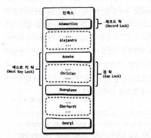
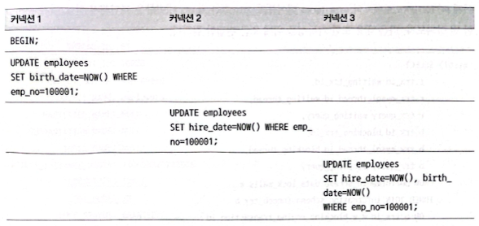
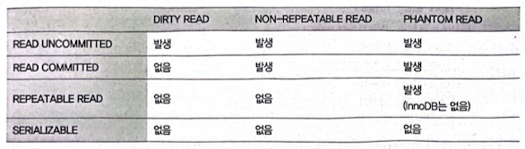
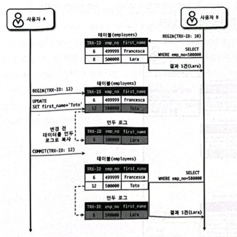

# 05. 트랜잭션과 잠금
- 트랜잭션은 작업의 완전성을 보장해 주는 것이다. 즉 논리적인 작업셋을 모두 완벽하게 처리하거나, 처리하지 못할 경우에는 원상태로 복구해서 작업의 일부만 적용되는 현상(Partial update)이 발생하지 않게 만들어주는 기능이다.
- 잠금(Lock)과 트랜잭션은 서로 비슷한 개념같지만 사실 잠금은 동시성을 제어하기 위한 기능이고 트랜잭션은 데이터의 정합성을 보장하기 위한 기능이다.
- 잠금은 여러 커넥션에서 동시에 동일한 자원(레코드나 테이블)을 요청할 경우 순서대로 한 시점에는 하나의 커넥션만 변경할 수 있게 해주는 역할을 한다.
- 격리 수준이라는 것은 하나의 트랜잭션 내에서 또는 여러 트랜잭션 간의 작업내용을 어떻게 공유하고 차단할 것인지를 결정하는 레벨을 의미한다.
## 5.1 트랜잭션
### 5.1.1 MySQL에서의 트랜잭션
- 트랜잭션은 하나의 논리적인 작업셋에 하나의 쿼리가 있든 두 개 이상의 쿼리가 있든 관계없이 논리적인 작업셋 자체가 100% 적용되거나(COMMIT을 실행했을 때) 아무것도 적용되지 않아야(ROLLBACK 또는 트랜잭션을 ROLLBACK시키는 오류가 발생했을 때) 함을 보장해주는 것이다.
- 부분 업데이트 현상이 발생하면 실패한 쿼리로 인해 남은 레코드를 다시 삭제하는 재처리 작업이 필요할 수 있다.
- 2개 이상의 쿼리가 실행되는 경우라면 실패에 대한 재처리 작업은 다음 예제와 같이 상당한 고민거리가 될 것이다.
```text
INSERT INTO tab_a ...;
IF(_is_insert1_succeed){
    INSERT INTO tab_b ...:
    IF(_is_insert2_succeed){
        // 처리 완료
    }ELSE{
        DELETE FROM tab_a WHERE ...:
        IF(_is_delete_succeed) {
            // 처리 실패 및 tab_a, tab_b 모두 원상 복구 완료
        }ELSE{
            // 해결 불가능한 심각한 상황 발생
            // 이제 어떻게 해야 하나?
            // tab_b에 INSERT는 안 되고, 하지만 tab.a에는 INSERT돼 버렸는데, 삭제는 안 되고...
        }
    }
}
```
- 위의 코드를 트랜잭션이 지원되는 InnoDB 테이블에서 처리한다고 가정하면 다음과 같은 간단한 코드로 완벽한 구현이 가능하다.
```text
try {
    START TRANSACTION:
    INSERT INTO tab_a ...:
    INSERT INTO tab_b ...:
    COMMIT;
} catch(exception) {
    ROLLBACK;
}
```
### 5.1.2 주의사항
- 트랜잭션 또한 DBMS의 커넥션과 동일하게 꼭 필요한 최소의 코드에만 적용하는 것이 좋다.
```text
1) 처리 시작
    => 데이터베이스 커넥션 생성
    => 트랜잭션 시작
2) 사용자의 로그인 여부 확인
3) 사용자의 글쓰기 내용의 오류 여부 확인
4) 첨부로 업로드된 파일 확인 및 저장
5) 사용자의 입력 내용을 DBMS에 저장
6) 첨부 파일 정보를 DBMS에 저장
7) 저장된 내용 또는 기타 정보를 DBMS에서 조회
8) 게시물 등록에 대한 알림 메일 발송
9) 알림 메일 발송 이력을 DBMS에 저장
    <= 트랜잭션 종료(COWNIT)
    <= 데이터베이스 커넥션 반납
10) 처리 완료
```
- 실제로 DBMS에 데이터를 저장하는 작업(트랜잭션)은 5번부터 시작된다는 것을 알 수 있다.
- 그래서 2번과 3번, 4번의 절차가 아무리 빨리 처리된다고 하더라도 DBMS의 트랜잭션에 포함시킬 필요는 없다.
- 더 큰 위험은 8번 작업이라고 볼 수 있다. 메일 전송이나 FTP 파일전송작업 또는 네트워크를 통해 원격서버와 통신하는 등과 같은 작업은 어떻게 해서든 DBMS의 트랜잭션 내에서 제거하는 것이 좋다.
- 프로그램이 실행되는 동안 메일서버와 통신할 수 없는 상황이 발생한다면 웹 서버뿐 아니라 DBMS 서버까지 위험해지는 상황이 발생할 것이다.
- 이 처리 절차에는 DBMS의 작업이 크게 4개가 있다. 사용자가 입력한 정보를 저장하는 5번과 6번 작업은 반드시 하나의 트랜잭션으로 묶어야 하며, 7번 작업은 저장된 데이터의 단순확인 및 조회이므로 트랜잭션에 포함할 필요는 없다.
- 그리고 9번 작업은 조금 성격이 다르기 때문에 이전 트랜잭션(5번과 6번 작업)에 함께 묶지 않아도 무방해 보인다.
- 이러한 작업은 별도의 트랜잭션으로 분리하는 것이 좋다. 그리고 7번 작업은 단순 조회라고 본다면 별도로 트랜잭션을 사용하지 않아도 무방해 보인다.
```text
1) 처리 시작
2) 사용자의 로그인 여부 확인
3) 사용자의 글쓰기 내용의 오류 발생 여부 확인
4) 첨부로 업로드된 파일 확인 및 저장
    => 데이터베이스 커넥션 생성(또는 커넥션 풀에서 가져오기)
    => 트랜잭션 시작
5) 사용자의 입력 내용을 DBMS에 저장
6) 첨부 파일 정보를 DBMS에 저장 
    <= 트랜잭션 종료(COMMIT)
7) 저장된 내용 또는 기타 정보를 DBWS에서 조회
8) 게시물 등록에 대한 알림 메일 발송 
    => 트랜잭션 시작
9) 알림 메일 발송 이력을 DBMS에 저장
    <= 트랜잭션 종료(COWNIT)
    <= 데이터베이스 커넥션 종료(또는 커넥션 품에 반납)
10) 처리 완료
```
## 5.2 MySQL 엔진의 잠금
- MySQL에서 사용되는 잠금은 크게 스토리지 엔진 레벨과 MySQL 엔진 레벨로 나눌 수 있다.
- MySOL 엔진 레벨의 잠금은 모든 스토리지 엔진에 영향을 미치지만, 스토리지 엔진레벨의 잠금은 스토리지 엔진간 상호 영향을 미치지는 않는다.
- MySQL 엔진에서는 테이블 데이터 동기화를 위한 테이블 락 이외에도 테이블의 구조를 잠그는 메타데이터 락(Metadata Lock) 그리고 사용자의 필요에 맞게 사용할 수 있는 네임드 락(Named Lock)이라는 잠금 기능도 제공한다.
### 5.2.1 글로벌 락
- 일단 한 세션에서 글로벌 락을 획득하면 다른 세션에서 SELECT를 제외한 대부분의 DDL 문장이나 DML 문장을 실행하는 경우 글로벌 락이 해제될 때까지 해당 문장이 대기 상태로 남는다.
- 글로벌 락이 영향을 미치는 범위는 MySQL 서버 전체이며, 작업대상 테이블이나 데이터베이스가 다르더라도 동일하게 영향을 미친다.
- 글로벌 락을 거는 `FLUSH TABLES WITH READ LOCK` 명령은 실행과 동시에 MySQL 서버에 존재하는 모든 테이블을 닫고 잠금을 건다.
- `FLUSH TABLES WITH READ LOCK` 명령은 테이블에 읽기잠금을 걸기 전에 먼저 테이블을 플러시해야 하기 때문에 테이블에 실행중인 모든 종류의 쿼리가 완료돼야 한다.
- 그래서 장시간 SELECT 쿼리가 실행되고 있을 때는 `FLUSH TABLES WITH READ LOCK` 명령은 SELECT 쿼리가 종료될 때까지 기다려야 한다.
- 장시간 실행되는 쿼리와 `FLUSH TABLES WITH READ LOCK` 명령이 최악의 케이스로 실행되면 MySQL 서버의 모든 테이블에 대한 INSERT, UPDATE, DELETE 쿼리가 아주 오랜 시간동안 실행되지 못하고 기다릴 수도 있다.
- MySQL 8.0부터는 InnoDB가 기본 스토리지 엔진으로 채택되면서 조금 더 가벼운 글로벌 락의 필요성이 생겼다.
- MySQL 8.0 버전부터는 Xtrabackup이나 Enterprise Backup과 같은 백업 툴들의 안정적인 실행을 위해 백업락이 도입됐다.
```text
mysql> LOCK INSTANCE FOR BACKUP:
-- // 백업 실행
mysql> UNLOCK INSTANCE;
```
- 특정 세션에서 백업락을 획득하면 모든 세션에서 다음과 같이 테이블의 스키마나 사용자의 인증관련 정보를 변경할 수 없게 된다.
  - 데이터베이스 및 테이블 등 모든 객체 생성 및 변경, 삭제
  - REPAIR TABLE과 OPTIMIZE TABLE 명령
  - 사용자 관리 및 비밀번호 변경
- 하지만 백업락은 일반적인 테이블의 데이터 변경은 허용된다.
- 일반적인 MySQL 서버의 구성은 소스 서버(Source server)와 레플리카 서버(Replica server)로 구성되는데, 주로 백업은 레플리카 서버에서 실행된다.
- 레플리카 서버에서 백업을 실행하는 도중에 소스 서버에 문제가 생기면 레플리카 서버의 데이터가 최신상태가 될 때까지 서비스를 멈춰야 할 수도 있다.
- 물론 XtraBackup이나 Enterprise Backup 툴들은 모두 복제가 진행되는 상태에서도 일관된 백업을 만들 수 있다.
- 하지만 XtraBackup이나 Enterprise Backup 툴이 실행되는 도중에 스키마 변경이 실행되면 백업은 실패하게 된다.
- 6~7시간 동안 백업이 실행되고 있는데, 갑자기 DDL 명령 하나로 인해 백업이 실패하면 다시 그만큼 시간을 들여서 백업을 실행해야 한다.
- MySQL 서버의 백업락은 이런 목적으로 도입됐으며, 정상적으로 복제는 실행되지만 백업의 실패를 막기 위해 DDL 명령이 실행되면 복제를 일시 중지하는 역할을 한다.
### 5.2.2 테이블 락
- 테이블 락(Table Lock)은 개별 테이블 단위로 설정되는 잠금이며, 명시적 또는 묵시적으로 특정 테이블의 락을 획득할 수 있다.
- 명시적으로는 "LOCK TABLES table_name [ READ | WRITE ]" 명령으로 특정 테이블의 락을 획득할 수 있다.
- 명시적으로 획득한 잠금은 UNLOCK TABLES 명령으로 잠금을 반납(해제)할 수 있다.
- InnoDB 테이블의 경우 스토리지 엔진 차원에서 레코드 기반의 잠금을 제공하기 때문에 단순 데이터 변경 쿼리로 인해 묵시적인 테이블 락이 설정되지는 않는다.
- 더 정확히는 InnoDB 테이블에도 테이블 락이 설정되지만 대부분의 데이터 변경(DML) 쿼리에서는 무시되고 스키마를 변경하는 쿼리(DDL)의 경우에만 영향을 미친다.
### 5.2.3 네임드 락
- 네임드 락은 단순히 사용자가 지정한 문자열(String)에 대해 획득하고 반납(해제)하는 잠금이다.
- 예를 들어, 데이터베이스 서버 1대에 5대의 웹 서버가 접속해서 서비스하는 상황에서 5대의 웹 서버가 어떤 정보를 동기화해야 하는 요건처럼 여러 클라이언트가 상호 동기화를 처리해야 할 때 네임드 락을 이용하면 쉽게 해결할 수 있다.
```text
-- // "mylock"이라는 문자열에 대해 잠금을 획득한다.
-- // 이미 잠금을 사용 중이면 2초 동안만 대기한다. (2초 이후 자동 장금 해제됨)
mysql> SELECT GET_LOCK('mylock', 2);
-- // "mylock"이라는 문자열에 대해 장금이 설정돼 있는지 확인한다.
mysql> SELECT IS_FREE_LOCK('mylock');
-- //"mylock"이라는 문자열에 대해 획득했던 잠금을 반납(해제)한다.
mysql> SELECT RELEASE_LOCK('mylock');
-- // 3개 함수 모두 정상적으로 락을 획득하거나 해제한 경우에는 1을,
-- // 아니면 NULL이나 0을 반환한다.
```
- 네임드 락의 경우 많은 레코드에 대해서 복잡한 요건으로 레코드를 변경하는 트랜잭션에 유용하게 사용할 수 있다.
- 배치 프로그램처럼 한꺼번에 많은 레코드를 변경하는 쿼리는 자주 데드락의 원인이 되곤 한다.
### 5.2.4 메타데이터 락
- 메타데이터 락(Metadata Lock)은 데이터베이스 객체(대표적으로 테이블이나 뷰 등)의 이름이나 구조를 변경하는 경우에 획득하는 잠금이다.
- 실시간으로 테이블을 바꿔야 하는 요건이 배치 프로그램에서 자주 발생하는데, 다음 예제를 잠깐 살펴보자.
```text
-- // 배치 프로그램에서 별도의 임시 테이블(rank_new)에 서비스용 랭킹 데이터를 생성

-- // 랭킹 배치가 완료되면 현재 서비스용 랭킹 테이블(rank)을 rank_backup으로 백업하고
-- // 새로 만들어진 랭킹 테이블(rank_new)을 서비스용으로 대체하고자 하는 경우
mysql> RENAME TABLE rank TO rank_backup, rank_new TO rank;
```
- 위와 같이 하나의 RENAME TABLE 명령문에 두 개의 RENAME 작업을 한꺼번에 실행하면 실제 애플리케이션에서는 "Table not found rank" 같은 상황을 발생시키지 않고 적용하는 것이 가능하다.
- 하지만 이 문장을 다음과 같이 2개로 나눠서 실행하면 아주 짧은 시간이지만 rank 테이블이 존재하지 않는 순간이 생기며, 그 순간에 실행되는 쿼리는 "Table not found rank" 오류를 발생시킨다.
```text
mysql> RENAME TABLE rank TO rank_backup;
mysql> RENAME TABLE rank_new TO rank;
```
- 때로는 메타데이터 잠금과 InnoDB의 트랜잭션을 동시에 사용해야 하는 경우도 있다.
- 다음과 같은 구조의 INSERT만 실행되는 로그 테이블을 가정해보자.
```text
mysql> CREATE TABLE access_10g (
            id BIGINT NOT NULL AUTO_INCREMENT,
            client_ip INT UNSIGNED,
            access_dttm TIMESTAMP,
            ...
            PRIMARY KEY(id)
        );
```
- 그런데 어느날 이 테이블의 구조를 변경해야 할 요건이 발생했다. 물론 MySQL 서버의 Online DDL을 이용해서 변경할수도 있지만 시간이 너무 오래 걸리는 경우라면 언두 로그의 증가와 Online DDL이 실행되는 동안 누적된 Online DDL 버퍼의 크기 등 고민해야 할 문제가 많다.
- 이때는 새로운 구조의 테이블을 생성하고 먼저 최근(1시간 직전 또는 하루 전)의 데이터까지는 프라이머리 키인 id 값을 범위별로 나눠서 여러 개의 스레드로 빠르게 복사한다.
```text
-- // 테이블의 압축을 적용하기 위해 KEY_BLOCK_SIZE=4 옵션을 추가해 신규 테이블을 생성
mysql› CREATE TABLE access_1o9_new (
            id BIGINT NOT NULL AUTO_INCREMENT,
            client_ip INT UNSIGNED,
            access_dttm TIMESTAMP,
            ...
            PRIMARY KEY(id)
        ) KEY_BLOCK_SIZE=4;
-- // 4개의 스레드를 이용해 id 범위별로 레코드를 신규 테이블로 복사
mysql_thread1> INSERT INTO access_log_new SELECT * FROM access_log WHERE id)=0 AND idK10000;
mysql_thread2> INSERT INTO access_log_new SELECT * FROM access_log WHERE id)=10000 AND id<20000;
mysql_thread3> INSERT INTO access_log_new SELECT * FROM access_log WHERE id>=20000 AND id 30000;
mysql_thread4> INSERT INTO access_log_new SELECT * FROM access_log WHERE id>=30000 AND id<40000;
```
- 그리고 나머지 데이터는 다음과 같이 트랜잭션과 테이블 잠금, RENAWE TABLE 명령으로 응용 프로그램의 중단없이 실행할 수 있다.
- 이때 "남은 데이터를 복사"하는 시간 동안은 테이블의 잠금으로 인해 INSERT를 할 수 없게 된다.
```text
-- // 트랜잭션을 autocommit으로 실행(BEGIN이나 START TRANSACTION으로 실행하면 안 됨)
mysql> SET autocommit=0;

-- // 작업 대상 테이블 2개에 대해 테이블 쓰기 락을 획득
mysql> LOCK TABLES access_log WRITE, access_log_new WRITE;

-- // 남은 데이터를 복사
mysql> SELECT MAX(id) as MAX_ID FROM access_10g;
mysql> INSERT INTO access_log_new SELECT * FROM access_log WHERE pk>@MAX_ID;
mysql> COMMIT:

-- // 새로운 테이블로 데이터 복사가 완료되면 RENME 명령으로 새로운 테이블을 서비스로 투입
mysql> RENAME TABLE access_log TO access_log_old, access_log_new TO access_log;
mysql> UNLOCK TABLES;

-- // 불필요한 테이블 삭제
mysql> DROP TABLE access_log_old;
```
## InnoDB 스토리지 엔진 잠금
### 5.3.1 InnoDB 스토리지 엔진의 잠금
- InnoDB 스토리지 엔진은 레코드 기반의 잠금기능을 제공하며, 잠금정보가 상당히 작은 공간으로 관리되기 때문에 레코드 락이 페이지 락으로, 또는 테이블 락으로 레벨업되는 경우(락 에스컬레이션)는 없다.
- InnoDB 스토리지 엔진에서는 레코드 락뿐 아니라 레코드와 레코드 사이의 간격을 잠그는 갭(GAP) 락이라는 것이 존재한다.


#### 5.3.1.1 레코드 락
- 레코드 자체만을 잠그는 것을 레코드 락(Record lock, Record only lock)이라고 한다.
- InnoDB 스토리지 엔진은 레코드 자체가 아니라 인덱스의 레코드를 잠근다는 점이다.
- 인덱스가 하나도 없는 테이블이더라도 내부적으로 자동생성된 클러스터 인덱스를 이용해 잠금을 설정한다.
- InnoDB에서는 프라이머리 키 또는 유니크 인덱스에 의한 변경 작업에서는 갭(Gap, 간격)에 대해서는 잠그지 않고 레코드 자체에 대해서만 락을 건다.
#### 5.3.1.2 갭락
- 갭 락은 레코드 자체가 아니라 레코드와 바로 인접한 레코드 사이의 간격만을 잠그는 것을 의미한다.
- 갭 락의 역할은 레코드와 레코드 사이의 간격에 새로운 레코드가 생성(INSERT)되는 것을 제어하는 것이다.
#### 5.3.1.3 넥스트 키 락
- 레코드 락과 갭 락을 합쳐놓은 형태의 잠금을 넥스트 키 락(Next key lock)이라고 한다.
- InnoDB의 갭 락이나 넥스트 키 락은 바이너리 로그에 기록되는 쿼리가 레플리카 서버에서 실행될 때 소스 서버에서 만들어낸 결과와 동일한 결과를 만들어내도록 보장하는 것이 주목적이다.
- 그런데 의외로 넥스트 키 락과 갭 락으로 인해 데드락이 발생하거나 다른 트랜잭션을 기다리게 만드는 일이 자주 발생한다.
- 가능하다면 바이너리 로그 포맷을 ROW 형태로 바꿔서 넥스트 키 락이나 갭 락을 줄이는 것이 좋다.
#### 5.3.1.4 자동 증가 락
- AUTO_INCREMENT 칼럼이 사용된 테이블에 동시에 여러 레코드가 INSERT되는 경우, 저장되는 각 레코드는 중복되지 않고 저장된 순서대로 증가하는 일련번호 값을 가져야 한다.
- InnoDB 스토리지 엔진에서는 이를 위해 내부적으로 AUTO_INCREMENT 락(Auto increment lock)이라고 하는 테이블 수준의 잠금을 사용한다.
- AUTO_INCREMENT 락은 INSERT와 REPLACE 쿼리 문장과 같이 새로운 레코드를 저장하는 쿼리에서만 필요하며, UPDATE나 DELETE 등의 쿼리에서는 걸리지 않는다.
- InnoDB의 다른 잠금(레코드 락이나 넥스트 키 락)과는 달리 AUTO_INCREMENT 락은 트랜잭션과 관계없이 INSERT나 REPLACE 문장에서 AUTO_INCREMENT 값을 가져오는 순간만 락이 걸렸다가 즉시 해제된다.
- AUTO_INCREMENT 락은 테이블에 단 하나만 존재하기 때문에 두 개의 INSERT 쿼리가 동시에 실행되는 경우 하나의 쿼리가 AUTO_INCREMENT 락을 걸면 나머지 쿼리는 AUTO_INCREMENT 락을 기다려야 한다.
- 자동 증가락에 대한 지금까지의 설명은 MySQL 5.0 이하 버전에서 사용되던 방식이다. MySQL 5.1 이상부터는 innodb_autoinc_lock_mode라는 시스템 변수를 이용해 자동 증가락의 작동방식을 변경할 수 있다.
  - innodb_autoinc_lock_mode=0
    - MySQL 5.0과 동일한 잠금 방식으로 모든 INSERT 문장은 자동 증가락을 사용한다.
  - innodb_autoinc_lock_mode=1
    - 단순히 한 건 또는 여러 건의 레코드를 INSERT하는 SQL 중에서 MySQL 서버가 INSERT 되는 레코드의 건수를 정확히 예측할 수 있을 때는 자동 증가락(Auto increment lock)을 사용하지 않고, 훨씬 가볍고 빠른 래치(유텍스)를 이용해 처리한다. 개선된 래치는 자동 증가락과 달리 아주 짧은 시간 동안만 잠금을 걸고 필요한 자동 증가값을 가져오면 즉시 잠금이 해제된다. 하지만 INSERT .. SELECT와 같이 MySQL 서버가 건수를 (쿼리를 실행하기 전에) 예측할 수 없을 때는 MySQL 5.0에서와같이 자동 증가락을 사용한다. 이때는 INSERT 문장이 완료되기 전까지는 자동 증가락은 해제되지 않기 때문에 다른 커넥션에서는 INSERT를 실행하지 못하고 대기하게 된다. 이렇게 대량 INSERT가 수행될 때는 InnoDB 스토리지 엔진은 여러 개의 자동 증가값을 한 번에 할당받아서 INSERT되는 레코드에 사용 한다. 그래서 대량 INSERT 되는 레코드는 자동 증가값이 누락되지 않고 연속되게 INSERT 된다. 하지만 한 번에 할당받은 자동 증가값이 남아서 사용되지 못하면 폐기하므로 대량 INSERT 문장의 실행 이후에 INSERT되는 레코드의 자동 증가값은 연속되지 않고 누락된 값이 발생할 수 있다.
  - innodb_autoinc_lock_mode=2
    - InnoDB 스토리지 엔진은 절대 자동 증가락을 걸지 않고 경량화된 래치(뮤텍스)를 사용한다. 하지만 이 설정에서는 하나의 INSERT 문장으로 INSERT 되는 레코드라고 하더라도 연속된 자동 증가값을 보장하지는 않는다. 그래서 이 설정 모드를 인터리빙 모드(nterleaved mode)라고도 한다. 이 설정모드에서는 INSERT ... SELECT와 같은 대량 INSERT 문장이 실행되는 중에도 다른 커넥션에서 INSERT를 수행할 수 있으므로 동시 처리 성능이 높아진다. 하지만 이 설정에서 작동하는 자동 증가 기능은 유니크한 값이 생성된다는 것만 보장한다, STATEMENT 포맷의 바이너리 로그를 사용하는 복제에서는 소스 서버와 레플리카 서버의 자동 증가값이 달라질 수도 있기 때문에 주의해야 한다.
### 5.3.2 인덱스와 잠금
- InnoDB의 잠금은 레코드를 잠그는 것이 아니라 인덱스를 잠그는 방식으로 처리된다.
- 즉, 변경해야 할 레코드를 찾기 위해 검색한 인덱스의 레코드를 모두 락을 걸어야 한다.
```text
-- // 예제 데이터베이스의 employees 테이블에는 아래와 같이 first_name 칼럼만
-- // 멤버로 담긴 ix_firstname이라는 인덱스가 준비돼 있다.
-- // KEY ix_firstname (first_name)
-- // employees 테이블에서 first_name='Georgi'인 사원은 전체 253명이 있으며,
-- // first_name='Georgi'이고 last_name='Klassen'인 사원은 딱 1명만 있는 것을 아래 쿼리로
- // 확인할 수 있다.
mysql> SELECT COUNT(*) FROM employees WHERE first_name='Georgi;
+--------+
|    253 |
+--------+

mysal> SELECT COUNT(*) FROM employees WHERE first_name='Georgi AND last_name='Klassen';
+--------+
|      1 |
+--------+
-- // employees 테이블에서 first_name='Georgi 이고 1ast_nane='Klassen 인 사원의
-- // 입사 일자를 오늘로 변경하는 쿼리를 실행해보자.
mysql> UPDATE employees SET hire_date=NON() WHERE first_name='Georgi' AND last_name='Klassen';
```
- 이 1건의 업데이트를 위해 몇 개의 레코드에 락을 걸어야 할까? 이 UPDATE 문장의 조건에서 인덱스를 이용할 수 있는 조건은 first_ name='Georgi'이며, last_name 칼럼은 인덱스에 없기 때문에 first_name='Georgi'인 레코드 253건의 레코드가 모두 잠긴다.
- 이 예제에서는 몇 건 안되는 레코드만 잠그지만 UPDATE 문장을 위해 적절히 인덱스가 준비돼 있지 않다면 각 클라이언트 간의 동시성이 상당히 떨어져서 한 세션에서 UPDATE 작업을 하는 중에는 다른 클라이언트는 그 테이블을 업데이트하지 못하고 기다려야 하는 상황이 발생할 것이다.
- 이 테이블에 인덱스가 하나도 없다면 어떻게 될까? 이러한 경우에는 테이블을 풀 스캔하면서 UPDATE 작업을 하는데, 이 과정에서 테이블에 있는 30여만 건의 모든 레코드를 잠그게 된다.
- 이것이 MySQL의 방식이며, MySQL의 InnoDB에서 인덱스 설계가 중요한 이유 또한 이것이다.
### 5.3.3 레코드 수준의 잠금 확인 및 해제
- 레코드 수준의 잠금은 테이블의 레코드 각각에 잠금이 걸리므로 그 레코드가 자주 사용되지 않는다면 오랜 시간 동안 잠겨진 상태로 남아있어도 잘 발견되지 않는다.


- MySQL 8.0 버전부터는 information_schema의 정보들은 조금씩 제거(Deprecated)되고 있으며, 그 대신 performance_schema의 data_locks와 data_lock_waits 테이블로 대체되고 있다.
- 아래 내용은 MySQL 서버에서 앞의 UPDATE 명령 3개가 실행된 상태의 프로세스 목록을 조회한 것이다.
- 17번 스레드는 지금 아무것도 하지 않고 있지만 트랜잭션을 시작하고 UPDATE 명령이 실행완료된 것이다.
- 하지만 아직 17번 스레드는 COMMIT을 실행하지는 않은 상태이므로 업데이트한 레코드의 잠금을 그대로 가지고 있는 상태다.
- 그래서 프로세스 목록에서 18번과 19번 스레드는 잠금 대기로 인해 아직 UPDATE 명령을 실행중인 것으로 표시된 것이다.
```text
mysql> SHOW PROCESSLIST;
+----+------+-------+------+---------+------+----------+--------------------------+
| Id | Time | State    | Info                                                     |
+----+------+-------+------+---------+------+----------+--------------------------+
| 17 | 607  |          | NULL                                                     |
| 18 | 21   | updating | UPDATE employees SET birth_date=NOW() WHERE emp_no=10001 |
| 19 | 21   | updating | UPDATE employees SET birth_date=NOW() WHERE emp_no=10001 |
+----+------+-------+------+---------+------+----------+--------------------------+
```
- 쿼리의 실행결과를 보면 현재 대기중인 스레드는 18번과 19번인 것을 알 수 있다.
- 18번 스레드는 17번 스레드를 기다리고 있고, 19번 스레드는 17번 스레드와 18번 스레드를 기다리고 있다는 것을 알 수 있다.
- 즉 17번 스레드가 가지고 있는 잠금을 해제하고, 18번 스레드가 그 잠금을 획득하고 UPDATE를 완료한 후 잠금을 풀어야만 비로소 19번 스레드가 UPDATE를 실행할 수 있음을 의미한다.
## MySQL의 격리 수준
- 트랜잭션의 격리 수준(isolation level)이란 여러 트랜잭션이 동시에 처리될 때 특정 트랜잭션이 다른 트랜잭션에서 변경하거나 조회하는 데이터를 볼 수 있게 허용할지 말지를 결정하는 것이다.
- "DIRTY READ"라고도 하는 READ UNCOMMITTED는 일반적인 데이터베이스에서는 거의 사용하지 않고, SERIALIZABLE 또한 동시성이 중요한 데이터베이스에서는 거의 사용되지 않는다.
- 4개의 격리수준에서 순서대로 뒤로 갈수록 각 트랜잭션 간의 데이터 격리(고립) 정도가 높아지며, 동시처리성능도 떨어지는 것이 일반적이라고 볼 수 있다.
- 격리 수준이 높아질수록 MySQL 서버의 처리성능이 많이 떨어질 것으로 1생각하는 사용자가 많은데, 사실 SERIALIZABLE 격리 수준이 아니라면 크게 성능의 개선이나 저하는 발생하지 않는다.


- InnoDB에서는 독특한 특성 때문에 REPEATABLE READ 격리수준에서도 PHANTOM READ가 발생하지 않는다.
- 오라클 같은 DBMS에서 는 주로 READ COMMITTED 수준을 많이 사용하며, MySOL에서는 REPEATABLE READ를 주로 사용한다.
### 5.4.1 READ UNCOMMITTED
- 각 트랜잭션에서의 변경 내용이 COMMIT의 나 ROLLBACK 여부에 상관없이 다른 트랜잭션에서 보인다.
- 어떤 트랜잭션에서 처리한 작업이 완료되지 않았는데도 다른 트랜잭션에서 볼 수 있는 현상을 더티 리드(Dirty read)라 하고, 더티 리드가 허용되는 격리 수준이 READ UNCOMMITTED다.
### 5.4.2 READ COMMITTED
- 사용자 A는 emp_no=500000인 사원의 first_name을 "Lara"에서 "Toto"로 변경했는데, 이 때 새로운 값인 "Toto"는 employees 테이블에 즉시 기록되고 이전 값인 Lara"는 언두 영역으로 백된다.
- 사용자 A가 커밋을 수행하기 전에 사용자 B가 emp_no=500000인 사원을 SELECT하면 조회된 결과의 first_name 칼럼의 값은 "Toto"가 아니라 'Lara"로 조회된다.
- 여기서 사용자 B의 SELECT 쿼리 결과는 employees 테이블이 아니라 언두 영역에 백업된 레코드에서 가져온 것이다.
- READ COMMITTED 격리 수준에서는 어떤 트랜잭션에서 변경한 내용이 커밋되기 전까지는 다른 트랜잭션에서 그러한 변경내역을 조회할 수 없기 때문이다.
- READ COMMITTED 격리 수준에서도 "NON-REPEATABLE READ" 라는 부정합의 문제가 있다.
- 처음 사용자 B가 BEGIN 명령으로 트랜잭션을 시작하고 first_name이 "Toto"인 사용자를 검색했는데, 일치하는 결과가 없었다.
- 하지만 사용자 A가 사원 번호가 500000인 사원의 이름을 "Toto"로 변경하고 커밋을 실행한 후, 사용자 B가 똑같은 SELECT 쿼리로 다시 조회하면 이번에는 결과가 1건이 조회된다.
- 이는 별다른 문제가 없어 보이지만, 사실 사용자 B가 하나의 트랜잭션 내에서 똑같은 SELECT 쿼리를 실행했을 때는 항상 같은 결과를 가져와야 한다는 REPEATABLE READ" 정합성에 어긋나는 것이다.
- 이러한 부정합 현상은 일반적인 웹 프로그램에서는 크게 문제되지 않을 수 있지만 하나의 트랜잭션에서 동일 데이터를 여러 번 읽고 변경하는 작업이 금전적인 처리와 연결되면 문제가 될 수도 있다.
- READ COMMITTED 격리 수준에서는 트랜잭션 내에서 실행되는 SELECT 문장과 트랜잭션 외부에서 실행되는 SELECT 문장의 차이가 별로 없다.
- 하지만 REPEATABLE READ 격리 수준에서는 기본적으로 SELECT 쿼리 문장도 트랜잭션 범위 내에서만 작동한다.
- 트랜잭션을 시작한 상태에서 온종일 동일한 쿼리를 반복해서 실행해봐도 동일한 결과만 보게 된다(아무리 다른 트랜잭션에서 그 데이터를 변경하고 COMMIT을 실행한다고 하더라도 말이다).
### 5.4.3 REPEATABLE READ
- REPEATABLE READ는 MysQL의 InnoDB 스토리지 엔진에서 기본으로 사용되는 격리 수준이다.
- InnoDB 스토리지 엔진은 트랜잭션이 ROLLBACK될 가능성에 대비해 변경되기 전 레코드를 언두(Undo) 공간에 백업해두고 실제 레코드 값을 변경한다. 이러한 변경 방식을 MVCC 라고 한다.
- REPEATABLE READ는 이 MVCC를 위해 언두 영역에 백업된 이전 데이터를 이용해 동일 트랜잭션 내에서는 동일한 결과를 보여줄 수 있게 보장한다.
- 사실 READ COMMITTED도 MVCC를 이용해 COMMIT되기 전의 데이터를 보여준다.
- REPEATABLE READ와 READ COMMITTED의 차이는 언두 영역에 백업된 레코드의 여러 버전 가운데 몇 번째 이전 버전까지 찾아 들어가야 하느냐에 있다.
- 모든 InnoDB의 트랜잭션은 고유한 트랜잭션 번호(순차적으로 증가하는 값)를 가지며, 언두 영역에 백업된 모든 레코드에는 변경을 발생시킨 트랜잭션의 번호가 포함돼 있다.
- 그리고 언두 영역의 백업된 데 이터는 InnoDB 스토리지 엔진이 불필요하다고 판단하는 시점에 주기적으로 삭제한다.
- REPEATABLE READ 격리 수준에서는 MVCC를 보장하기 위해 실행중인 트랜잭션 가운데 가장 오래된 트랜잭션 번호보다 트랜잭션 번호가 앞선 언두 영역의 데이터는 삭제할 수가 없다.
- 그렇다고 가장 오래된 트랜잭션 번호 이전의 트랜잭션에 의해 변경된 모든 언두 데이터가 필요한 것은 아니다.
- 더 정확하게는 특정 트랜잭션 번호의 구간 내에서 백업된 언두 데이터가 보존돼야 한다.
- employees 테이블의 초기 두 레코드는 트랜잭션 번호가 6으로 표현된 것이다.


- 사용자 A의 트랜잭션 번호는 12였으며 사용자 B의 트랜잭션의 번호는 10이었다.
- 이때 사용자 A는 사원의 이름을 "Toto'로 변경하고 커밋을 수행했다.
- 그런데 A 트랜잭션이 변경을 수행하고 커밋을 했지만, 사용자 B가 emp_no=500000인 사원을 A 트랜잭션의 변경 전후 각각 한 번씩 SELECT 했는데 결과는 항상 "Lara"라는 값을 가져온다.
- 사용자 B가 BEGIN 명령으로 트랜잭션을 시작하면서 10 번이라는 트랜잭션 번호를 부여받았는데, 그때부터 사용자 B의 10번 트랜잭션 안에서 실행되는 모든 SELECT 쿼리는 트랜잭션 번호가 10(자신의 트랜잭션 번호)보다 작은 트랜잭션 번호에서 변경한 것만 보게 된다.
- 언두 영역에 백업된 데이터가 하나만 있는 것으로 표현했지만 사실 하나의 레코드에 대해 백업이 하나 이상 얼마든지 존재할 수 있다.
- 한 사용자가 BEGIN으로 트랜잭션을 시작하고 장시간 트랜잭션을 종료하지 않으면 언두 영역이 백업된 데이터로 무한정 커질수도 있다.
- 이렇게 언두에 백업 된 레코드가 많아지면 MySQL 서버의 처리성능이 떨어질 수 있다.
- 사용자 B는 BEGIN 명령으로 트랜잭션을 시작한 후 SELECT를 수행한다.
- REPEATABLE READ에서 배운 것처럼 두 번의 SELECT 쿼리 결과는 똑같아야 한다.
- 하지만 서 사용자 B가 실행하는 두 번의 SELECT ... FOR UPDATE 쿼리 결과는 서로 다르다. 
- 이렇게 다른 트랜 잭션에서 수행한 변경 작업에 의해 레코드가 보였다 안보였다 하는 현상을 PHANTOM READ(또는 PHANTOM ROW)라고 한다.
- SELECT ... FOR UPDATE 쿼리는 SELECT하는 레코드에 쓰기 잠금을 걸어야 하는데, 언두 레코드에는 잠금을 걸 수 없다.
- 그래서 SELECT ... FOR UPDATE SELECT ... LOCK IN SHARE MODE로 조회되는 레코드는 언두 영역의 변경 전 데이터를 가져오는 것이 아니라 현재 레코드의 값을 가져오게 되는 것이다.
### 5.4.4 SERIALIZABLE
- 트랜잭션의 격리 수준이 SERIALIZABLE로 설정되면 읽기 작업도 공유 잠금(읽기 잠금)을 획득해야만 하며, 동시에 다른 트랜잭션은 그러한 레코드를 변경하지 못하게 된다.
- SERIALIZABLE 격리 수준에서는 일반적인 DBMS에서 일어나는 "PHANTOM READ"라는 문제가 발생하지 않는다.
- 하지만 InnoDB 스토리지 엔진에서는 갭 락과 넥스트 키 락 덕분에 REPEATABLE READ 격리 수준에서도 이미 'PHANTOM READ"가 발생하지 않기 때문에 굳이 SERIALIZABLE을 사용할 필요성은 없어 보인다.