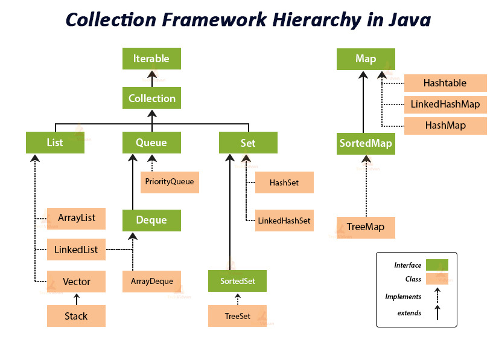

# CH.04 어디에 담아야 하는지...
## Collection 및 Map 인터페이스의 이해

- Collection: 가장 상위 인터페이스이다.
- Set: 중복을 허용하지 않는 집합을 처리하기 위한 인터페이스이다. 
- SortedSet: 오름차순을 갖는 Set 인터페이스이다.
- List: 순서가 있는 집합을 처리하기 위한 인터페이스이기 때문에 인덱스가 있어 위치를 지정하여 값을 찾을 수 있다. 중복을 허용하며, List 인터페이스를 상속받는 클래스 중에 가장 많이 사용하는 것으로 ArrayList가 있다. 
- Queue: 여러 개의 객체를 처리하기 전에 담아서 처리할 때 사용하기 위한 인터페이스이다. 기본적으로 FIFO를 따른다. 
- Map: Map은 키와 값의 쌍으로 구성된 객체의 집합을 처리하기 위한 인터페이스이다. 이 객체는 중복되는 키를 허용하지 않는다. 
- SortedMap: 키를 오름차순으로 정렬하는 Map 인터페이스이다.
<br>
<br>
- HashSet: 데이터를 해쉬 테이블에 담는 클래스로 순서없이 저장된다. 
- TreeSet: red-black이라는 트리에 데이터를 담는다. 값에 따라서 순서가 정해진다. 데이터를 담으면서 동시에 정렬을 하기 때문에 HashSet 보다 성능상 느리다.
- LinkedHashSet: 해쉬 테이블에 데이터를 담는데, 저장된 순서에 따라서 순서가 결정된다.
- red-black 트리란 이진 트리 구조로 데이터를 담는 구조를 말한다.
- List 인터페이스를 구현한 클래스들은 담을 수 있는 크기가 자동으로 증가되므로, 데이터의 개수를 확실히 모를 때 유용하게 사용된다.
<br>
<br>
- Vetor: 객체 생성시에 크기를 지정할 필요가 없는 배열 클래스이다. 
- ArrayList: Vector와 비슷하지만, 동기화 처리가 되어 있지 않다. 
- LinkedList: ArrayList와 동일하지만, Queue 인터페이스를 구현했기 때문에 FIFO 큐 작업을 수행한다.
- 단일 객체만 저장되는 다른 Collection API들과는 다르게 따로 분리되어 있다.
<br>
<br>
- Hashtable: 데이터를 해쉬 테이블에 담는 클래스이다. 내부에서 관리하는 해쉬 테이블 객체가 동기화되어 있으므로, 동기화가 필요한 부분에서는 이 클래스를 사용하기 바란다. 
- HashMap: 데이터를 해쉬 테이블에 담는 클래스이다. Hashtable 클래스와 다른 점은 null 값을 허용한다는 것과 동기화되어 있지 않다는 것이다. 
- TreeMap: red-black 트리에 데이터를 담는다. TreeSet과 다른 점은 키에 의해서 순서가 정해진다는 것이다. 
- LinkedHashMap: HashMap과 거의 동일하며 이중 연결 리스트(doubly-linkedlist)라는 방식을 사용하여 데이터를 담는다는 점만 다르다.
<br>
<br>
- Queue는 데이터를 담아 두었다가 먼저 들어온 데이터부터 처리하기 위해서 사용된다.
- List도 순서가 있고, Queue도 순서가 있는데 왜 굳이 Queue가 필요할까?
  List의 가장 큰 단점은 데이터가 많은 경우 처리시간이 늘어난다는 점이다.
- 가장 앞에 있는 데이터(0번 데이터)를 지우면 그 다음 1번 데이터부터 마지막 데이터까지 한 칸씩 옮기는 작업을 수행해야 하므로, 데이터가 적을 때는 상관없지만, 데이터가 많으면 많을수록 가장 앞에 있는 데이터를 지우는데 소요되는 시간이 증가된다.
<br>
<br>
- PriorityQueue: 큐에 추가된 순서와 상관없이 먼저 생성된 객체가 먼저 나오도록 되어 있는 큐다. 
- LinkedBlockingQueue: 저장할 데이터의 크기를 선택적으로 정할수도 있는 FIFO 기반의 링크 노드를 사용하는 블로킹 큐다. 
- ArrayBlocking Queue: 저장되는 데이터의 크기가 정해져 있는 FIFO 기반의 블로킹 큐다. 
- PriorityBlockingQueue: 저장되는 데이터의 크기가 정해져 있지 않고, 객체의 생성순서에 따라서 순서가 저장되는 블로킹 큐다.
- DelayQueue: 큐가 대기하는 시간을 지정하여 처리하도록 되어 있는 큐다.
- SynchronousQueue: put() 메서드를 호출하면, 다른 스레드에서 take() 메서드가 호출될 때까지 대기하도록 되어있는 큐다.
## Set 클래스 중 무엇이 가장 빠를까?
```java
@State(Scope.Thread)
@BenchmarkMode({ Mode.AverageTime })
@OutputTimeUnit(TimeUnit.MICROSECONDS)
public class SetAdd {
    int LOOP_COUNT = 1000;
    Set<String> set;
    String data = "abcdefghijklmnopqrstuvwxyz";

    @GenerateMicroBenchmark
    public void addHashSet() {
        set = new HashSet<String>();
        for (int loop = 0; loop < LOOP_COUNT; loop++) {
            set.add(data + loop);
        }
    }

    @GenerateMicroBenchmark
    public void addTreeSet() {
        set = new TreeSet<String>();
        for (int loop = 0; loop < LOOP_COUNT; loop++) {
            set.add(data + loop);
        }
    }
    
    @GenerateMicroBenchmark
    public void addLinkedHashSet() {
        set = new LinkedHashSet<String>();
        for (int loop = 0; loop < LOOP_COUNT; loop++) {
            set.add(data + loop);
        }
    }
}
```
|대상| 평균 응답 시간 (마이크로초) |
|---|------------------|
|`HashSet`| 375              |
|`TreeSet`| 1,249            |
|`LinkedHashSet`| 378              |
- `HashSet`과 `LinkedHashSet`의 성능이 비슷하고, `TreeSet`의 순서로 성능차이가 발생한다.
- 추가로 다음과 같이 Set의 초기크기를 지정하여 객체를 생성한 후 데이터를 add하는 테스트 코드를 작성해 볼 수 있다.
```java
@GenerateMicroBenchmark
public void addHashSetWithInitialSize() {
    set = new HashSet<String>(LOOP_COUNT);
    for(int loop = 0; loop < LOOP_COUNT; loop++) {
        set.add(data + loop);
    }
}
```
|대상| 평균 응답 시간 (마이크로초) |
|---|------------------|
|`HashSet`| 375              |
|`HashSetWithInitialSize`| 352              |
- 큰 차이는 발생하지 않지만 저장되는 데이터의 크기를 알고 있을 경우에는 객체 생성시 크기를 미리 지정하는 것이 성능상 유리하다.
- 데이터를 읽을 때
```java
@State(Scope.Thread)
@BenchmarkMode({ Mode.AverageTime })
@OutputTimeUnit(TimeUnit.MICROSECONDS)
public class SetIterate {

    int LOOP_COUNT = 1000;
    Set<String> hashSet;
    Set<String> treeSet;
    Set<String> linkedHashSet;

    String data = "abcdefghijklmnopqrstuvwxyz";
    String [] keys;
    
    String result = null;

    @Setup(Level.Trial)
    public void setUp() {
        hashSet = new HashSet<String>();
        treeSet = new TreeSet<String>();
        linkedHashSet = new LinkedHashSet<String>();
        
        for(int loop = 0; loop < LOOP_COUNT; loop++) {
            String tempData = data + loop;
            hashSet.add(tempData);
            treeSet.add(tempData);
            linkedHashSet.add(tempData);
        }
    }

    @GenerateMicroBenchmark
    public void iterateHashSet() {
        Iterator<String> iter = hashSet.iterator();
        while(iter.hasNext()) {
            result = iter.next();
        }
    }

    @GenerateMicroBenchmark
    public void iterateTreeSet() {
        Iterator<String> iter = treeSet.iterator();
        while(iter.hasNext()) {
            result = iter.next();
        }
    }

    @GenerateMicroBenchmark
    public void iterateLinkedHashSet() {
        Iterator<String> iter = linkedHashSet.iterator();
        while(iter.hasNext()) {
            result = iter.next();
        }
    }
}
```
|대상| 평균 응답 시간 (마이크로초)   |
|---|--------------------|
|`HashSet`| 26                 |
|`TreeSet`| 35                 |
|`LinkedHashSet`| 16                 |
- 확인해 보면 `LinkedHashSet`이 가장 빠르고, `HashSet`, `TreeSet` 순으로 데이터를 가져오는 속도가 느려진다.
- 그런데, `Set`을 이렇게 사용하는 독자도 있겠지만, 일반적으로 `Set`은 여러 데이터를 넣어두고 해당 데이터가 존재하는지를 확인하는 용도로 많이 사용된다.
- 따라서, 데이터를 `Iterator`로 가져오는 것이 아니라, 랜덤하게 가져와야만 한다.
```java
public class RandomKeyUtil {

    public static String[] generateRandomSetKeysSwap(Set<String> set) {
        int size = set.size();
        String result[] = new String[size];
        Random random = new Random();
        int maxNumber = size;
        Iterator<String> iterator = set.iterator();
        int resultPos = 0;
        
        while (iterator.hasNext()) {
            result[resultPos++] = iterator.next();
        }
        
        for (int loop = 0; loop < size; loop++) {
            int randomNumber1 = random.nextInt(maxNumber);
            int randomNumber2 = random.nextInt(maxNumber);
            String temp = result[randomNumber2];
            result[randomNumber2] = result[randomNumber1];
            result[randomNumber1] = temp;
        }
        
        return result;
    }
}
```
- 비순차적으로 데이터를 뽑는 SetContains 클래스
```java
@State(Scope.Thread)
@BenchmarkMode({ Mode.AverageTime })
@OutputTimeUnit(TimeUnit.MICROSECONDS)
public class SetContains {
    int LOOP_COUNT = 1000;
    Set<String> hashSet;
    Set<String> treeSet;
    Set<String> linkedHashSet;

    String data = "abcdefghijklmnopqrstuvwxyz";
    String [] keys;

    @Setup(Level.Trial)
    public void setUp() {
        hashSet = new HashSet<String>();
        treeSet = new TreeSet<String>();
        linkedHashSet = new LinkedHashSet<String>();
        
        for(int loop = 0; loop < LOOP_COUNT; loop++) {
            String tempData = data + loop;
            hashSet.add(tempData);
            treeSet.add(tempData);
            linkedHashSet.add(tempData);
        }
        
        if(keys==null || keys.length != LOOP_COUNT) {
            keys = RandomKeyUtil.generateRandomSetKeysSwap(hashSet);
        }
    }

    @GenerateMicroBenchmark
    public void containsHashSet() {
        for(String key:keys) {
            hashSet.contains(key);
        }
    }

    @GenerateMicroBenchmark
    public void containsTreeSet() {
        for(String key:keys) {
            treeSet.contains(key);
        }
    }

    @GenerateMicroBenchmark
    public void containsLinkedHashSet() {
        for(String key:keys) {
            linkedHashSet.contains(key);
        }
    }
}
```
|대상| 평균 응답 시간 (마이크로초) |
|---|------------------|
|`HashSet`| 32               |
|`TreeSet`| 841              |
|`LinkedHashSet`| 32               |
- `HashSet`과 `LinkedHashSet`의 속도는 빠르지만, `TreeSet`의 속도는 느리다는 것을 알 수 있다.
- 그러면 왜 결과가 항상 느리게 나오는 `TreeSet` 클래스를 만들었을까?
- 여러분들이 `Iterate` 클래스를 사용하여 데이터를 꺼내보면 알겠지만, `Treeset`은 데이터를 저장하면서 정렬한다.
```java
public class TreeSet<E>extends AbstractSet<E> 
        implements NavigableSet<E>, Cloneable, Serializable
```
- 구현한 인터페이스 중에 `NavigableSet`이 있다.
- 이 인터페이스는 특정 값보다 큰 값이나 작은 값, 가장 큰 값, 가장 작은 값 등을 추출하는 메서드를 선언해 놓았으며 JDK 1.6부터 추가된 것이다.
## List 관련 클래스 중 무엇이 빠를까?
```java
@State(Scope.Thread)
@BenchmarkMode({ Mode.AverageTime })
@OutputTimeUnit(TimeUnit.MICROSECONDS)
public class ListAdd {
    int LOOP_COUNT = 1000;
    List<Integer> arrayList;
    List<Integer> vector;
    List<Integer> linkedList;

    @GenerateMicroBenchmark
    public void addArrayList() {
        arrayList = new ArrayList<Integer>();
        
        for(int loop = 0; loop < LOOP_COUNT; loop++) {
            arrayList.add(loop);
        }
    }
    
    @GenerateMicroBenchmark
    public void addVector() {
        vector = new Vector<Integer>();
        
        for(int loop = 0; loop < LOOP_COUNT; loop++) {
            vector.add(loop);
        }
    }
    
    @GenerateMicroBenchmark
    public void addLinkedList() {
        linkedList = new LinkedList<Integer>();
        
        for(int loop = 0; loop < LOOP_COUNT; loop++) {
            linkedList.add(loop);
        }
    }
}
```
|대상| 평균 응답 시간 (마이크로초) |
|---|------------------|
|`ArrayList`| 28               |
|`Vector`| 31               |
|`LinkedList`| 40               |
- 데이터를 넣는 속도는 어떤 클래스든 큰 차이가 없는 것을 볼 수 있다.
- 데이터를 꺼내는 속도
```java
@State(Scope.Thread)
@BenchmarkMode({ Mode.AverageTime })
@OutputTimeUnit(TimeUnit.MICROSECONDS)
public class ListGet {
    int LOOP_COUNT = 1000;
    List<Integer> arrayList;
    List<Integer> vector;
    LinkedList<Integer> linkedList;
    
    int result = 0;

    @Setup
    public void setUp() {
        arrayList = new ArrayList<Integer>();
        vector = new Vector<Integer>();
        linkedList = new LinkedList<Integer>();
        
        for(int loop = 0; loop < LOOP_COUNT; loop++) {
            arrayList.add(loop);
            vector.add(loop);
            linkedList.add(loop);
        }
    }

    @GenerateMicroBenchmark
    public void getArrayList() {
        for(int loop = 0; loop < LOOP_COUNT; loop++) {
            result = arrayList.get(loop);
        }
    }
    
    @GenerateMicroBenchmark
    public void getVector() {
        for(int loop = 0; loop < LOOP_COUNT; loop++) {
            result = vector.get(loop);
        }
    }

    @GenerateMicroBenchmark
    public void getLinkedList() {
        for(int loop = 0; loop < LOOP_COUNT; loop++) {
            result = linkedList.get(loop);
        }
    }
}
```
| 대상           | 평균 응답 시간 (마이크로초) |
|:-------------| ---------------------- |
| `ArrayList`  | 4 |
| `Vector`     | 105 |
| `LinkedList`   | 1,512 |
- `ArrayList`의 속도가 가장 빠르고, `Vector`와 `LinkedList`는 속도가 매우 느리다.
- `LinkedList`가 터무니없이 느리게 나온 이유는 `LinkedList`가 `Queue` 인터페이스를 상속받기 때문이다.
```java
@GenerateMicroBenchmark
public void peekLinkedList() {
    for(int loop = 0; loop < LOOP_COUNT; loop++) {
        result = linkedList.peek();
    }
}
```
| 대상 | 평균 응답 시간 (마이크로초) |
| :--- | ---------------------- |
| `ArrayList` | 4 |
| `Vector` | 105 |
| `LinkedList` | 1,512 |
| `LinkedListPeek` | 0.16 |
- `ArrayList`는 여전히 응답속도가 빠르고, 그 다음에 `LinkedList`, `Vector` 순으로 순서가 바뀌었다.
- `LinkedList` 클래스를 사용할 때는 `get()` 메서드가 아닌 `peek()`이나 `poll()` 메서드를 사용해야 한다.
- 왜 `ArrayList`와 `Vector`의 성능차이가 이렇게 클까?
- `ArrayList`는 여러 스레드에서 접근할 경우 문제가 발생할 수 있지만, `Vector`는 여러 스레드에서 접근할 경우를 방지하기 위해서 `get()` 메서드에 `synchronized`가 선언되어 있다.
- 따라서, 성능 저하가 발생할 수밖에 없다.
- 데이터를 삭제하는 속도
```java
@State(Scope.Thread)
@BenchmarkMode({ Mode.AverageTime })
@OutputTimeUnit(TimeUnit.MICROSECONDS)
public class ListRemove {

    int LOOP_COUNT = 10;
    List<Integer> arrayList;
    List<Integer> vector;
    LinkedList<Integer> linkedList;

    @Setup(Level.Trial)
    public void setUp() {
        arrayList = new ArrayList<Integer>();
        vector = new Vector<Integer>();
        linkedList = new LinkedList<Integer>();
        
        for(int loop = 0; loop < LOOP_COUNT; loop++) {
            arrayList.add(loop);
            vector.add(loop);
            linkedList.add(loop);
        }
    }

    @GenerateMicroBenchmark
    public void removeArrayListFromFirst() {
        ArrayList<Integer> tempList = new ArrayList<Integer>(arrayList);
        for(int loop = 0; loop < LOOP_COUNT; loop++) {
            tempList.remove(0);
        }
    }

    @GenerateMicroBenchmark
    public void removeVectorFromFirst() {
        List<Integer> tempList = new Vector<Integer>(vector);
        for(int loop = 0; loop < LOOP_COUNT; loop++) {
            tempList.remove(0);
        }
    }

    @GenerateMicroBenchmark
    public void removeLinkedListFromFirst() {
        LinkedList<Integer> tempList = new LinkedList<Integer>(linkedList);
        for(int loop = 0; loop < LOOP_COUNT; loop++) {
            tempList.remove(0);
        }
    }
    
    @GenerateMicroBenchmark
    public void removeArrayListFromLast() {
        ArrayList<Integer> tempList = new ArrayList<Integer>(arrayList);
        for(int loop = LOOP_COUNT - 1; loop >= 0; loop--) {
            tempList.remove(loop);
        }
    }

    @GenerateMicroBenchmark
    public void removeVectorFromLast() {
        List<Integer> tempList = new Vector<Integer>(vector);
        for(int loop = LOOP_COUNT - 1; loop >= 0; loop--) {
            tempList.remove(loop);
        }
    }

    @GenerateMicroBenchmark
    public void removeLinkedListFromLast() {
        LinkedList<Integer> tempList = new LinkedList<Integer>(linkedList);
        for(int loop = 0; loop < LOOP_COUNT; loop++) {
            tempList.removeLast();
        }
    }
}
```
| 대상 | 평균 응답 시간 (마이크로초) |
| :--- | ---------------------- |
| `ArrayListFirst` | 418 |
| `ArrayListLast` | 146 |
| `VectorFirst` | 687 |
| `VectorLast` | 426 |
| `LinkedListFirst` | 423 |
| `LinkedListLast` | 407 |
- 결과를 보면 첫 번째 값을 삭제하는 메서드와 마지막 값을 삭제하는 메서드의 속도 차이는 크다.
- `LinkedList`는 별 차이가 없다.
- `ArrayList`나 `Vector`는 실제로 그 안에 배열을 사용한다.
- 그 배열의 0번째 값을 삭제하면 첫 번 재에 있던 값이 0번째로 와야만 한다.
- 그런데, 하나의 값만 옮겨야 하는 것이 아니라 첫 번째부터 마지막에 있는 값까지 위치를 변경해야만 한다.
- 따라서, `ArrayList`와 `Vector`의 첫번째 값을 삭제하면 이렇게 느릴 수밖에 없다.
## Map 관련 클래스 중에서 무엇이 빠를까?
- 데이터를 꺼내는 시간
```java
@State(Scope.Thread)
@BenchmarkMode(Mode.AverageTime)
@OutputTimeUnit(TimeUnit.MICROSECONDS)
public class MapGet {

    int LOOP_COUNT = 1000;
    Map<Integer, String> hashMap;
    Map<Integer, String> hashtable;
    Map<Integer, String> treeMap;
    Map<Integer, String> linkedHashMap;
    int keys[];

    @Setup(Level.Trial)
    public void setup() {
        if (keys == null || keys.length != LOOP_COUNT) {
            hashMap = new HashMap<Integer, String>();
            hashtable = new Hashtable<Integer, String>();
            treeMap = new TreeMap<Integer, String>();
            linkedHashMap = new LinkedHashMap<Integer, String>();
            String data = "abcdefghijklmnopqrstuvwxyz";

            for (int loop = 0; loop < LOOP_COUNT; loop++) {
                String tempData = data + loop;
                hashMap.put(loop, tempData);
                hashtable.put(loop, tempData);
                treeMap.put(loop, tempData);
                linkedHashMap.put(loop, tempData);
            }

            keys = RandomKeyUtil.generateRandomNumberKeysSwap(LOOP_COUNT);
        }
    }

    @GenerateMicroBenchmark
    public void getSeqHashMap() {
        for (int loop = 0; loop < LOOP_COUNT; loop++) {
            hashMap.get(loop);
        }
    }

    @GenerateMicroBenchmark
    public void getRandomHashMap() {
        for (int loop = 0; loop < LOOP_COUNT; loop++) {
            hashMap.get(keys[loop]);
        }
    }

    @GenerateMicroBenchmark
    public void getSeqHashtable() {
        for (int loop = 0; loop < LOOP_COUNT; loop++) {
            hashtable.get(loop);
        }
    }

    @GenerateMicroBenchmark
    public void getRandomHashtable() {
        for (int loop = 0; loop < LOOP_COUNT; loop++) {
            hashtable.get(keys[loop]);
        }
    }

    @GenerateMicroBenchmark
    public void getSeqTreeMap() {
        for (int loop = 0; loop < LOOP_COUNT; loop++) {
            treeMap.get(loop);
        }
    }

    @GenerateMicroBenchmark
    public void getRandomTreeMap() {
        for (int loop = 0; loop < LOOP_COUNT; loop++) {
            treeMap.get(keys[loop]);
        }
    }

    @GenerateMicroBenchmark
    public void getSeqLinkedHashMap() {
        for (int loop = 0; loop < LOOP_COUNT; loop++) {
            linkedHashMap.get(loop);
        }
    }

    @GenerateMicroBenchmark
    public void getRandomLinkedHashMap() {
        for (int loop = 0; loop < LOOP_COUNT; loop++) {
            linkedHashMap.get(keys[loop]);
        }
    }
}
```
| 대상 | 평균 응답 시간 | 대상 | 평균 응답 시간 |
|---|---|---|---|
| `SeqHashMap` | 32 | `RandomHashMap` | 40 |
| `SeqHashtable` | 106 | `RandomHashtable` | 120 |
| `SeqLinkedHashMap` | 34 | `RandomLinkedHashMap` | 46 |
| `SeqTreeMap` | 197 | `RandomTreeMap` | 277 |
- 각 클래스는 용도가 모두 다르다.
- 성능이 빠른 클래스가 필요하다면 이야기는 달라지겠지만, 여러분들이 필요한 용도에 가장 적합한 클래스를 선택하여 사용하는게 가장 중요하다.
- 각 인터페이스별로 가장 일반적으로 사용되는 클래스는 다음과 같다.

| 인터페이스 | 클래스 |
|---|---|
| Set | HashSet |
| List | ArrayList |
| Map | HashMap |
| Queue | LinkedList |
## Collection 관련 클래스의 동기화
- `HashSet`, `TreeSet`, `LinkedHashSet`, `ArrayList`, `LinkedList`, `HashMap`, `TreeMap`, `LinkedHashMap`은 동기화(synchronized)되지 않은 클래스이다.
- 동기화되어 있는 클래스로는 `Vector`와 `Hashtable`이 있다.
- JDK 1.0 버전에 생성된 `Vector`나 `Hashtable`은 동기화처리가 되어있지만, JDK 1.2 버전 이후에 만들어진 클래스는 모두 동기화처리가 되어있지 않다.
