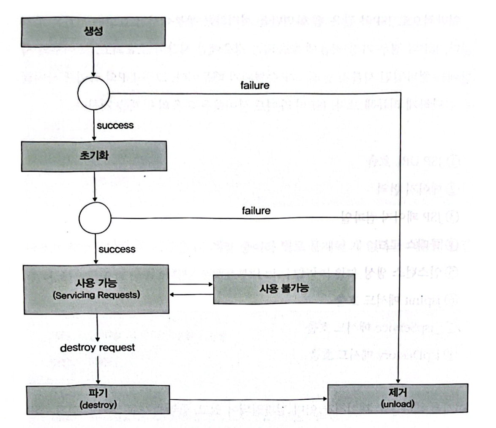

# CH.11 JSP와 서블릿, Spring에서 발생할 수 있는 여러 문제점
## JSP와 Servlet의 기본적인 동작 원리는 꼭 알아야 한다
- JSP의 라이프 사이클
  1. JSP URL 호출 
  2. 페이지 번역 
  3. JSP 페이지 컴파일 
  4. 클래스 로드 
  5. 인스턴스 생성 
  6. jspInit 메서드 호출 
  7. _jspService 메서드 호출 
  8. jspDestory 메서드 호출
- JSP 페이지가 이미 컴파일되어 있고, 클래스가 로드되어 있고, JSP 파일이 변경되지 않았다면, 가장 많은 시간이 소요되는 2-4 프로세스는 생략된다.
- 서블릿의 라이프 사이클



- 서블릿은 JVM에 여러 객체로 생성되지 않는다.
-  WAS가 시작하고, '사용 가능' 상태가 된 이상 대부분의 서블릿은 JVM에 살아있고, 여러 스레드에서 해당 서블릿의 `service()` 메서드를 호출하여 공유한다.
- 만약 서블릿 클래스의 메서드 내에 선언한 지역변수가 아닌 멤버변수(인스턴스 변수)를 선언하여 `service()` 메서드에서 사용하면 어떤 일이 벌어질까?
```java
public class DontUserLikeThisServlet extends HttpServlet {
    private static final long serialVersionUID = 1L;
    String successFlag="N";

    public DontUserLikeThisServlet() {
        super();
    }

    protected void doGet(HttpServletRequest request,
            HttpServletResponse response) throws ServletException, IOException {
        successFlag=request.getParameter("successFlag");
    }
}
```
- successFlag 값은 여러 스레드에서 접근하면서 계속 값이 바뀔 것이다.
- 데이터가 꼬여서 원하지 않는 값들이 출력될 수도 있다.
## 적절한 include 사용하기
- include 기능을 사용하면, 하나의 JSP에서 다른 JSP를 호출하여 여러 JSP 파일을 혼합해서 하나의 JSP로 만들 수 있다.
- JSP에서 사용할 수 있는 include 방식은 정적인 방식(indude directive)과 동적인 방식(include action)이 있다.
- 정적인 방식은 JSP의 라이프사이클 중 JSP 페이지 번역 및 컴파일 단계에서 필요한 JSP를 읽어서 메인 JSP의 자바소스 및 클래스에 포함을 시키는 방식이다.
- 동적인 방식은 페이지가 호출될 때마다 지정된 페이지를 불러들여서 수행하도록 되어있다.
- 동적인 방식이 정적인 방식보다 느릴 수밖에 없다.
- 모든 화면을 정적인 방식으로 구성하면 잘 수행되던 화면에서 오류가 발생할 수 있다.
- 정적인 방식을 사용하면 메인 JSP에 추가되는 JSP가 생긴다.
- 이 때 추가된 JSP와 메인 JSP에 동일한 이름의 변수가 있으면 심각한 오류가 발생할 수 있다.
## 자바 빈즈, 잘 쓰면 약 못쓰면 독
- 자바 빈즈(Java Beans)는 UI에서 서버측 데이터를 담아서 처리하기 위한 컴포넌트이다.
- useBean을 너무 많이 사용하면 JSP에서 소요되는 시간이 증가될 수 있다.
```html
<jsp:useBean id="list" scope="request"
class="java.util.ArrayList" type="java.util.List" />
<jsp:useBean id="count" scope="request" class="java.lang.String" />
<jsp:useBean id="pageNo" scope="request" class="java.lang-String" />
<jsp:useBean id="pageSize" scope="request" class="java.lang.String" />
```
- 이 화면의 경우 DB 까지 전체 처리하는데 소요된 시간은 97ms이며, 그중 JSP에서 소요된 시간이 57ms이다.
- 그리고 JSP에서 자바 빈즈를 처리하기 위해서 소요된 시간은 47ms로, 전체 응답 시간의 48%에 해당하는 시간이다.
- 이 시간을 줄이기 위해서는 1장에서 설명한 TO(Transfer object) 패턴을 사용해야 한다.
- 하나의 TO 클래스를 만들고, 위의 예에서 사용된 각 문자열 및 HashMap, List를 그 클래스의 변수로 지정하여 사용하면 화면을 수행하는데 소요된 시간 중 48%가 절약된다.
## 태그 라이브러리도 잘 써야 한다.
- 태그 라이브러리(Tag library)는 JSP에서 공통적으로 반복되는 코드를 클래스로 만들고, 그 클래스를 HTML 태그와 같이 정의된 태그로 사용할 수 있도록 하는 라이브러리다.
- 태그 라이브러리는 XML 기반의 tld 파일과 태그 클래스로 구성되어 있다.
- 태그 라이브러리를 사용하기 위해서는 web.xml 파일을 열어 tld의 URI와 파일 위치를 정의해야 한다.
```html

<web-app>
    <taglib>
        <taglib-uri>/tagLibURI</taglib-uri>
        <tablib-location>
            /WEB-INF/tlds/tagLib.tld
        </taglib-location>
    </taglib>
</web-app>
```
```xml
<?xml version="1.0" encoding="IS0-8859-1"?>
<taglib
        xmlns="http://java.sun.com/xm1/ns/javaee"
        xmlns:xsi="http://www.w3.org/2001/XMLSchema-instance"
        xsi:schemaLocation="http://java.sun.com/xml/ns/javaee
        http://java.sun.com/xml/ns/javaee/web-jsptaglibrary_2_1.xsd"
        version="2.1">
    <tlibversion>1.0</tlibversion>
    <jspversion>1.1</jspversion>
    <shortname>tagLibSample</shortname>
    <uri/>
    <tag>
        <name>tagLibSample</name>
        <tagclass>com.perf.jsp.TagLibSample</tagclass>
        <bodycontent>JSP</bodycontent>
    </tag>
</taglib>
```
- 태그 라이브러리 클래스를 잘못 작성하거나 태그 라이브러리 클래스로 전송되는 데이터가 많을 때 성능에 문제가 된다.
## 스프링 프레 임워크 간단 정리
- 스프링 프레임워크를 웹 프레임워크로 오해하는 분들이 많다.
- 하지만, 스프링 프레임워크는 데스크톱과 웹 애플리케이션, 작고 간단한 애플리케이션부터 여러 서버와 연동하여 동작해야 하는 엔터프라이즈 애플리케이션도 범용적인 애플리케이션 프레임워크다.
- Spring의 가장 큰 특징은 복잡한 애플리케이션도 POJO(Plain Old Java Object)로 개발할 수 있다는 점이다.(Servlet은 POJO가 아니다.)
- Servlet을 개발하려면 반드시 `HttpServlet`이라는 클래스를 상속해야 한다.
- 하지만 스프링을 사용하면 `HttpServlet`을 확장하지 않아도 웹 요청을 처리할 수 있는 클래스를 만들 수 있다.
- 이밖에도 JMS, JMK, Mail, Web Service 등 여러 가지 기능을 POJO 기반으로 사용할 수 있기 때문에, 개발자가 보다 쉽게 자신이 작성한 코드를 테스트 할 수 있다.
### 스프링의 핵심 기술
- 스프링의 핵심 기술은 바로 Dependency Injection, Aspect Oriented Programming, Portable Service Abstraction으로 함축할 수 있다.
#### Dependency Injection
- 객체는 보통 혼자서 모든 일을 처리하지 않고, 여러 다른 객체와 협업하여 일을 처리한다.
- 이때 자신과 협업하는 객체와 자신과의 의존성을 가능한 낮춰야 유리한 경우가 많다.
- 어떤 객체가 필요로 하는 객체를 자기자신이 직접 생성하여 사용하는 것이 아니라 외부에 있는 다른 무언가로부터 필요로 하는 객체를 주입받는 기술이다.
#### AOP
- 트랜잭션, 로깅, 보완 체크 코드
- 이런 코드들은 여러 모듈, 여러 계층에 스며들기 마련이다.
- 필요한 작업이긴 하지만 대부분은 비슷한 코드가 중복되고, 코드를 눈으로 읽는 데 방해가 된다.
- 이런 코드를 실제 비즈니스 로직과 분리할 수 있도록 도와주는 것이 바로 AOP다.
- 자바에서 가장 유명한 AOP 프레임워크로는 AspectJ가 있다.
#### PSA
- 객체를 XML로 변경하거나 반대로 XML을 다시 객체로 변경하고 싶을 때 사용할 수 있는 라이브러리에는 JAXB, Castor, XMLBeans, JiBX가 있다.
- 트랜잭션 처리를 하고 싶을 때 사용하는 기술에 따라 JDBC 트랜잭션 API를 사용해야 할 수도 있고, iBatis가 제공하는 API, 또는 Hibernate가 제공하는 API를 사용할 수도 있다.
- 비슷한 기술을 구현하기 위해 코딩하는 방법은 사용할 라이브러리나 프레임워크에 따라 달라지기 때문에, 추상화가 매우 중요하다.
## 스프링 프레임워크를 사용하면서 발생할 수 있는 문제점들
- 스프링 프레임워크를 사용할 때 성능 문제가 가장 많이 발생하는 부분은 '프록시(Proxy)'와 관련되어 있다.
- 개발할 때 적은 요청을 할 때는 이상이 없다가, 요청량이 많은 운영상황으로 넘어가면 문제가 나타날 수 있다.
- 스프링이 프록시를 사용하게 하는 주요기능은 바로 트랜잭션이다.
- `@Transactional` 어노테이션을 사용하면 해당 어노테이션을 사용한 클래스의 인스턴스를 처음 만들때 프록시 객체를 만든다.
- 개발자가 직접 스프링 AOP를 사용해서 별도의 기능을 추가하는 경우에도 프록시를 사용하는데, 이 부분에서 문제가 많이 발생한다.
- `@Trasactional`처럼 스프링이 자체적으로 제공하는 기능은 이미 상당히 오랜 시간 테스트를 거치고 많은 사용자에게 검증을 받았지만, 개발자가 직접 작성한 AOP 코드는 예상하지 못한 성능문제를 보일 가능성이 매우 높다.