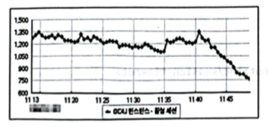
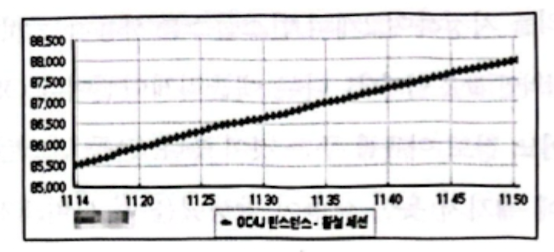

# CH.14 서버를 어떻게 세팅해야 할까?
## 설정해야 하는 대상
- 웹 기반의 시스템에서 성능
  - 웹 서버 세팅
  - WAS 서버 세팅
  - DB 서버 세팅
  - 장비 세팅
## 아파치 웹 서버의 설정
- 웹 서버는 반드시 WAS 앞에 두어야 한다.
- 정적인 부분은 웹 서버에서 처리해야 한다.
- 웹 서버를 WAS 서버 앞에 두지 않으면 이미지, CSS, 자바 스크림트, HTML 등을 처리하느라 아까운 WAS 서버의 스레드를 점유하게 된다.
- 아파치 웹 서버는 MPM이라는 것을 사용한다.
- MPM은 Multi-Processing Module의 약자로 여러 개의 프로세싱 모듈기반의 서비스를 제공한다는 의미이다.
- 아파치 웹 서버의 설정을 바꾸는 방법은, 설치폴더 하단의 conf 디렉터리에 있는 httpd.conf 파일을 수정하는 것이다.
```text
ThreadsPerChild 250
MaxRequestsPerChild e
```
- ThreadsPerChild는 웹 서버가 사용하는 스레드의 개수를 지정한다.
- 아파치 프로세스 하나당 250개의 스레드가 만들어진다.
- MaxRequestsPerChild는 최대 요청개수를 지정하는 부분이다.
- 0이면 그 수에 제한을 두지 않겠다는 의미가 된다.
- 스레드와 관련된 내용을 보다 세밀하게 지정하려면 httpd.conf 파일에서 #으로 주석 처리되어 있는"Include conf/extra/httpd-mpm.conf"를 찾아서 주석을 해제한다. 
- 세밀한 스레드 설정정보를 httpd-mpm.conf를 통해서 지정할 수 있게 된다.
```text
<IfModule mpm _worker_module>
StartServers 2
MaxClients 150
MinSpareThreads 25
MaxSpareThreads 75
ThreadsPerChild 25
MaxRequestsPerChild e
</IfModule>
```
- StartServers: 서버를 띄울 때 프로세스의 개수를 지정한다. 보통 이야기하는 child 프로세스의 개수를 이야기한다.
- MaxClients: 최대 처리 가능한 클라이언트의 수를 지정한다.
- MinSpare Threads: 최소 여유 스레드 수를 지정한다.
- MaxSpare Threads: 최대 여유 스레드 수를 지정한다.
- ThreadsPerChild: 프로세스당 스레드 수를 지정한다.
- MaxRequestsPerChild: MaxRequestsPerChild와 같은 의미이다.
- 프로세스 수(StartServers)가 2개이고, 프로세스당 스레드 수(ThreadPer Child)가 25이므로 기본적으로 50개의 요청을 처리할 수 있다.
- 어떤 서비스가 초당 150명의 요청을 받고있다고 가정해 보자.
- 자바는 GC를 할 때 JVM 자체가 멈춘다. 만약 이 GC가 2초 걸리면 어떻게 될까?
- 아파치 웹 서버에 총 300명의 요청이 기다리게 될 것이다.
- 그런데 GC를 하는동안 WAS가 멈추기 때문에 새로운 연결을 할 수 없다.
- Tomcat에서는 AJP Connector라는 웹 서버와 WAS 사이의 커넥터에 설정한 backlog라는 값의 영향을 받는다. 이 값을 설정하지 않으면 기본값은 100이다.
- WAS가 응답하지 않을 때 100개의 요청까지 큐에 담아둔다는 말이다.
- 이 100개를 넘는 요청들은 503(Service Unavailable)이 라는 HTTP 헤더 코드값을 리턴받게 된다.
- 그러면 사용자에게 503이라는 에러 메시지가 화면에 뿌려질 것이다.
## 웹 서버의 Keep Alive
- 웹 서버와 웹 브라우저가 연결이 되었을 때 KeepAlive 기능이 켜져있지 않으면, 매번 HTTP 연결을 맺었다 끊었다 하는 작업을 반복한다.
- 초기화면이 매우 간단한 구글과 같은 사이트는 해당 사이트에 연결할 때 KeepAlive가 적용되지 않더라도 그리 느리지 않을 것이다.
- 하지만 네이버나 다음과 같이 초기화면에서 엄청나게 많은 이미지와 CSS, 자바스크립트 등의 파일을 받아야 하는 사이트에서 KeepAlive 옵션이 적용되어 있지 않다면, 초기화면을 띄우는 데 몇 분씩 소요될지도 모른다.
- 사용자의 접근이 많은 사이트에서는 이미지나 CSS와 같이 정적인 파일들을 일반적인 웹 서버에서 처리하지 않고, CDN(Content Delivery Network)이라고 하는 서비스를 사용한다.
- 별도의 URL에서 해당 컨텐츠들을 내려받도록 설정하고, 동적인 컨텐츠들은 WAS에서 처리하도록 해 놓으면 Web-WAS 서버의 부담도 줄어들게 된다.
- KeepAlive-Timeout 설정은 초 단위로 KeepAlive가 끊기는 시간을 설정하기 위한 부분이다.
- 마지막 연결이 끝난 이후에 다음연결이 될 때까지 얼마나 기다릴지를 지정한다.
## DB Connection Pool 및 스레드 개수 설정
- 이 두 항목의 개수는 메모리와 관련이 있다.
- 대부분의 WAS에서는 DB Connection Pool의 개수를 최소치, 중가치, 최대치 등으로 자세하게 지정할 수 있다.
- 운영 중에는 최소 및 최대값을 동일하게 하는 것이 좋다.
- 사용자 수가 갑자기 중가하면 DB Connection Pool의 개수도 증가되어야 하고, 증가할 때 대기시간이 발생할 확률이 크기 때문이다.
- DB Connection Pool은 보통 40~50개로 지정하며, 스레드개수는 이보다 10개 정도 더 지정한다.
- 이렇게 지정하는 이유는, 스레드 개수가 DB Connection Pool의 개수보다 적으면 적은 수만큼의 연결은 필요없기 때문이다.
- DB Connection Pool을 40개로 잡아 놓았다고 가정하자.
- 40개 전부를 사용하면서 DB의 CPU 사용량이 100%에 도달했다면, 어떻게 해야 할까?
- 이 경우에는 DB의 CPU를 점유하는 퀴리를 찾아서 튜닝을 수행해야 한다.
- 인덱스가 없거나 테이블을 풀 스캔하는 쿼리가 있는것은 아닌지 쿼리의 플랜을 떠서 확인해 봐야 한다.
- 40개를 전부 사용한다고 해서 DB Connection Pool 개수를 80~200개로 늘리면, 모든 DB와의 연결을 전부 사용하고 응답시간은 엄청나게 느려질 뿐이다. 
- 이번에는 DB의 CPU 사용량은 50%도 되지 않는 상황에서 WAS의 CPU 사용량이 100%에 도달하고 있는 상황을 생각해보자.
- DB Connection Pool의 개수는 20개 정도밖에 되지 않는다. 이럴 때는 어떻게 할까?
- 이 경우에는 WAS의 애플리케이션을 튜닝해야 한다. 하지만 이미 튜닝이 된 상태라면 이 서버의 DB Connection Pool의 개수는 약간의 여유를 두기 위해서 25~30개 정도로 지정하는 것이 좋다.
- DB Connection Pool의 개수를 넘어섰을 때 애플리케이션에서는 '어디 남는 Connection 없나?'하고 두리번거리면서 기다린다.
- 이 기다리는 시간이 바로 대기시간이다.
- MyBatis에서는 poolTimeToWait라는 값으로 이 대기시간을 결정하며, 기본은 20초다.
- 이 값을 그냥 놔둘 경우 DB 연결을 못해 기다리는 사용자들이 적어도 20초는 대기해야 한다는 말이다.
## WAS 인스턴스 개수 설정
- 서버의 WAS 인스턴스 개수를 늘리면 늘릴수록 CPU가 처리해야 하는 양이 많아진다.
- 하나의 장비에 20개 이상의 인스턴스, CPU 코어의 개수도 4~8개 정도. 그런 사이트는 성능이 잘 안 나오는 경우가 대부분이다. 여러개의 인스턴스에서 경합을 하면서 CPU를 차지하려고 하기 때문이다.
- 보통은 1~2개의 CPU당 하나의 인스턴스를 지정하는 것이 좋다고 이야기한다.
- 하지만 장비 하나당 인스턴스 개수는 성능 테스트를 통해서 구하는 것이 가장 바람직하다.
## Session Timeout 시간 설정

- 시간이 지남에 따라 세션의 개수가 증가했다가 감소했다가 하는 것을 볼 수 있다.
- 점심시간이 다가오면서 세션의 개수가 감소하는 현상이 발생하고 있다. 가장 정상적인 상황이다.


- 점심시간이 다가오는데도 세션 수가 계속 증가하고 있다.
- 문제의 원인은 바로 세션종료시간이다. 정상적인 서버의 경우 세션종료시간을 4분으로 해놓은 반면, 이 서버는 5,256,000분으로 설정을 해 놓았기 때문이다.